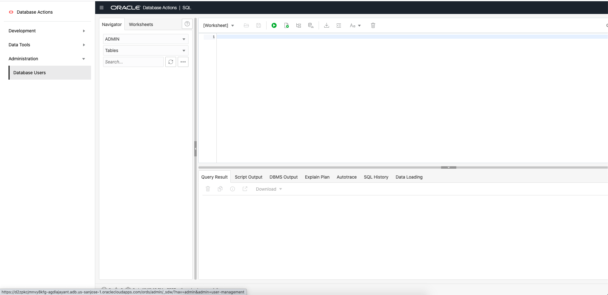
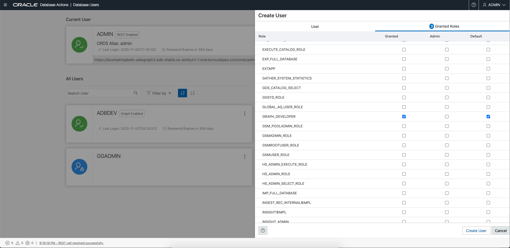
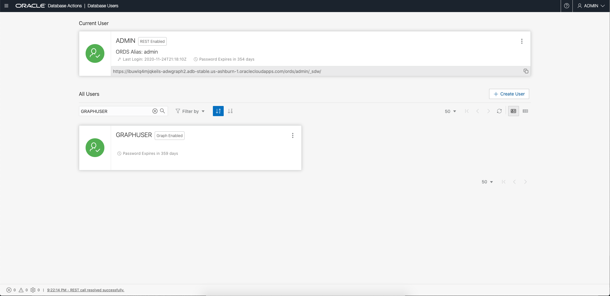
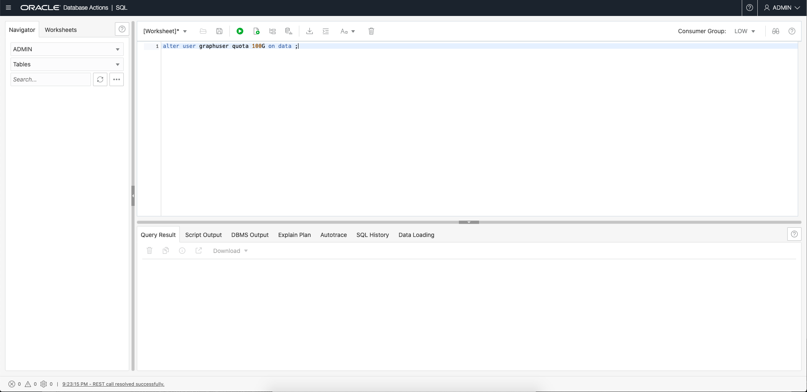

# Create the Graph User

## Introduction

In this lab you will create a database user with the appropriate roles and privileges required for using the graph capabilities of the Autonomous Database.

**Note: While this lab uses Autonomous Data Warehouse, the steps are identical for creating and connecting to an Autonomous Transaction Processing database.**

Estimated Lab Time: 5 minutes. 

### Objectives

Learn how to
-  create a database user with the appropriate roles and privileges required for accessing **Graph Studio**


### Prerequisites

- The following lab requires an Autonomous Data Warehouse - Shared Infrastructure or Autonomous Transaction Processing - Shared Infrastructure account. 

## **STEP 1**: Connect to the Database Actions (aka SQL Developer Web) for your Auronomous Database instance

1. Open the service detail page for your Autonomous Database instance in the OCI console. 

2. Click on the Tools tab and then the Database Actions link to open it. Or click on the Service Console link and then the Development link and open Database Actions (or SQL DeveloperWeb).

## **STEP 2**: Create the graph-enabled user

1. Login as the ADMIN user for your Autonomous Database instance. 

    

2. Click the navigation menu, expand the `Administration` sub-menu and click on `Database Users`. 
   
   
   
3. Click on the `+ Create User` icon:

    

4. Enter the required details, i.e. user name and password. Turn on the **Graph Enable** radio button. And select a quota to allocate on the `DATA` tablespace.
   
    

**Note: Please do not Graph Enable the ADMIN user and do not login to Graph Studio as the ADMIN user.**

5. Click the `Create User` button at the bottom of the panel to create the user with the specified credentials.
   
     

   The newly created user will now be listed.

      

   **Note: Another option is to just enter the optional sql commands listed below when logged in as ADMIN.**
   
6. Now allocate a desired table space quota to the newly created user. Open the SQL page and issue the alter command.  
   For example, 
   `ALTER USER GRAPHUSER QUOTA 100G ON DATA;`   
   will allocate a quota of 100 Gigabytes for the user `GRAPHUSER` in the tablespace named `DATA`.  
   Copy and paste the following command into the SQL worksheet.  
   Substitute the correct values for  `<username>` and `<quota>` and then click on Run to execute it.
   ```
   <copy>
   ALTER USER <username> QUOTA <quota> ON DATA;
   </copy>
   ```

   **Note: If you prefer to enable the Graph user via SQL commands then use the folowing statements:**
   ```
   <copy>
   -- Optional statements to use in place of the UI of the Administration page
   GRANT GRAPH_DEVELOPER TO <username> ;
   ALTER USER <username> GRANT CONNECT THROUGH "GRAPH$PROXY_USER";
   </copy>
   ``` 

   The screenshots below show an example of executing the ALTER USER statement.

     

     

    
 

Please **proceed to the next lab** to learn how to create and analyze graphs in ADB.

## Acknowledgements
* **Author** - Jayant Sharma, Product Development
* **Last Updated By/Date** - Jayant Sharma, April 2021
  
