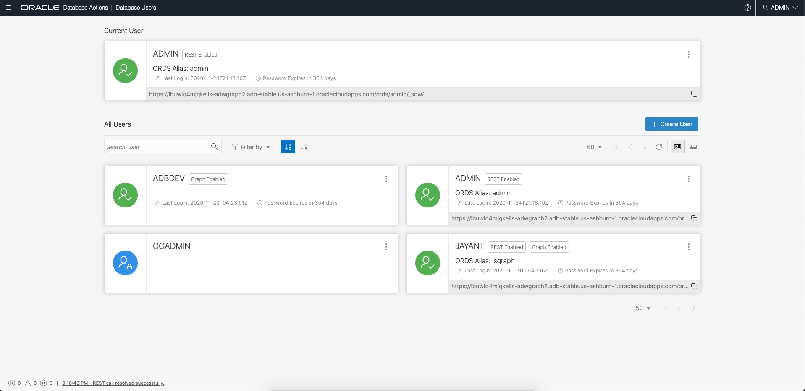
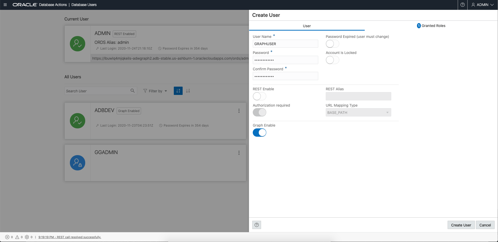
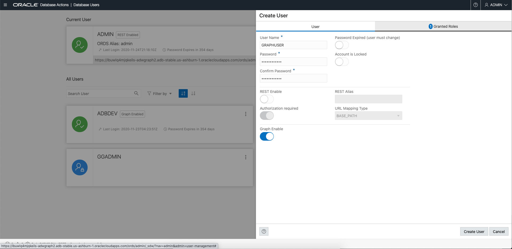
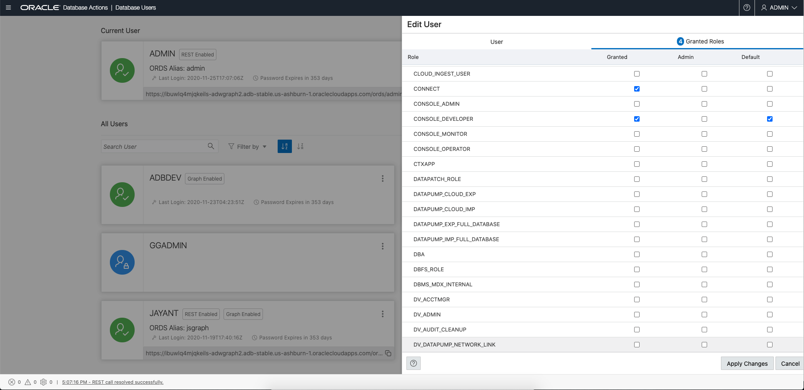

# Create the Graph User

## Introduction

In this lab you will create a database user with the appropriate roles and privileges required for using the graph capabilities of the Autonomous Database.

**Note: While this lab uses ADW, the steps are identical for an ATP database.**

Estimated Lab Time: 5 minutes. 

### Objectives

Learn how to
-  create a database user with the appropriate roles and privileges required for accessing **Graph Studio**


### Prerequisites

- The following lab requires an ADB-Shared (ADW/ATP) account. 

## **STEP 1**: Connect to the Database Actions (aka SQL Developer Web) for your ADB instance

1. Open the service detail page for your ADB instance in the OCI console. 

2. Click on the Tools tab and then the Database Actions link to open it. Or click on the Service Console link and then the Development link and open Database Actions (or SQL DeveloperWeb).

## **STEP 2**: Create the graph-enabled user

1. Login as the ADMIN user for your ADB instance. 

    

2. Click on the `+ Create User` icon:

    

3. Enter the required details, i.e. user name and passwrod. Turn on the **Graph Enable** radio button.
   
    

4. Click the `Granted Roles` tab
   
   

5. Scroll down and enable the CONSOLE_DEVELOPER role. Click both the `Granted` and `Default` checkboxes for that role.  
   Also grant CONNECT and RESOURCE roles.

     

   **Note:** The `CONSOLE_DEVELOPER` role is only needed during the *Limited Availability* period.  

6. Click the `Create User` button at the bottom of the panel to create the user with the specified credentials.
   
     

   The newly created user will now be listed.

     
   
7. Now allocate a desired table space quota to the newly created user. Open the SQL page and issue the alter command.  
   For example, 
   `ALTER USER GRAPHUSER QUOTA 100G ON DATA;`   
   will allocate a quota of 100 Gigabytes for the user `GRAPHUSER` in the tablespace named `DATA`.  
   Copy and paste the following command into the SQL worksheet.  
   Substitute the correct values for  `<username>` and `<quota>` and then click on Run to execute it.
   ```
   <copy>
   ALTER USER <username> QUOTA <quota> ON DATA;
   </copy>
   ```

   The screenshots below show an example of executing the ALTER USER statement.

     

     

    
 

Please **proceed to the next lab** to learn how to create and analyze graphs in ADB.

## Acknowledgements
* **Author** - Jayant Sharma, Product Development
* **Last Updated By/Date** - Jayant Sharma, Nov 2020
  
## Need Help?
Please submit feedback or ask for help using our [LiveLabs Support Forum](https://community.oracle.com/tech/developers/categories/oracle-graph). Please click the **Log In** button and login using your Oracle Account. Click the **Ask A Question** button to the left to start a *New Discussion* or *Ask a Question*.  Please include your workshop name and lab name.  You can also include screenshots and attach files.  Engage directly with the author of the workshop.

If you do not have an Oracle Account, click [here](https://profile.oracle.com/myprofile/account/create-account.jspx) to create one.
