# Create a BDS Hadoop Cluster

## Introduction

In this lab, you will learn how to create a simple non-Highly-Available (non-HA) Cloudera Distribution Including Apache Hadoop (CDH) cluster using the Oracle Cloud Infrastructure Console (OCI) and Big Data Service (BDS). This will be a small testing cluster that is not intended to process huge amounts of data. It will be based on small Virtual Machine (VM) shapes that are perfect for developing applications and testing functionality at a minimal cost.

Estimated Lab Time: 75 minutes

### Objectives

* Create a simple non-HA Hadoop cluster using BDS and OCI.
* Monitor the cluster creation.
* Review the locations of the various services in the new cluster.

### What Do You Need?
<if type="livelabs">
This lab assumes that you have reviewed the optional **Lab 1: Review Creating BDS Environment Resources (Optional)** in this workshop. This lab helps you get familiar with the OCI recourses that you will need to create a BDS cluster.
</if>

<if type="freetier">
This lab assumes that you have successfully completed **Lab 1: Set Up Your BDS Environment Resources** in this workshop. This lab explains the few tasks that are required to get started with BDS.
</if>

### Video Preview

Watch a video demonstration of creating a simple non-HA Hadoop cluster:

## **STEP 1:** Create a Cluster
There are many options when creating a cluster. You will need to understand the sizing requirements based on your use case and performance needs. In this lab, you will create a small testing and development cluster that is not intended to process huge amounts of data. It will be based on small Virtual Machine (VM) shapes that are perfect for developing applications and testing functionality at a minimal cost.

Your simple non-HA cluster will have the following profile:
  + **Nodes:** **1 Master** node, **1 Utility** node, and **3 Worker** nodes.
  + **Master and Utility Nodes Shapes:** **VM.Standard2.4** shape for the Master and Utility nodes. This shape provides **4 CPUs** and **60 GB** of memory.
  + **Worker Nodes Shape:** **VM.Standard2.1** shape for the Worker nodes in the cluster. This shape provides **1 CPU** and **15 GB** of memory.
  + **Storage Size:** **150 GB** block storage for the Master, Utility, and Worker nodes.

  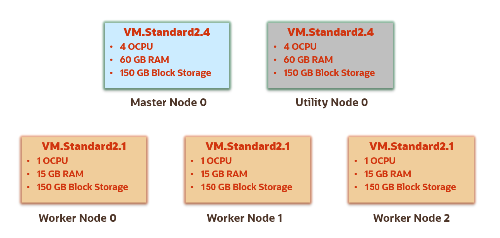

  **Note:**    
  VM Standard Shapes offer the most flexibility. For example, you can increase the storage capacity for each node. For better performance and scalability, change the preceding specifications appropriately. Consider **DenseIO** shapes and **Bare Metal** shapes. **DenseIO** shapes are designed for large databases, big data workloads, and applications that require high-performance local storage. They include direct locally-attached NVMe-based SSDs. See [Compute Shapes](https://docs.cloud.oracle.com/en-us/iaas/Content/Compute/References/computeshapes.htm#vm-dense) in the Oracle Cloud Infrastructure documentation.

  <if type="livelabs">
  _**Important:**_    
  _Since you are running this workshop using the LiveLabs environment, some of the resources' names that you will use in this lab such as the tenancy, compartment, user, VCN, and so on, use the LiveLabs naming conventions and are already created for you._
  </if>

Create the cluster as follows:

<if type="livelabs">
1. Log in to the **Oracle Cloud Console**, if you are not already logged in, using your LiveLabs credentials and instructions. The **Oracle Cloud Console** Home page is displayed.
</if>

<if type="freetier">
1. Log in to the **Oracle Cloud Console** as the Cloud Administrator that you used to create the resources in **Lab 1**, if you are not already logged in. On the **Sign In** page, select your `tenancy` if needed, enter your `username` and `password`, and then click **Sign In**. The **Oracle Cloud Console** Home page is displayed.
</if>

2. Click the **Navigation** menu in the upper left-hand corner of the **Oracle Cloud Console** page.

3. Under **Data and AI**, select **Big Data**.

   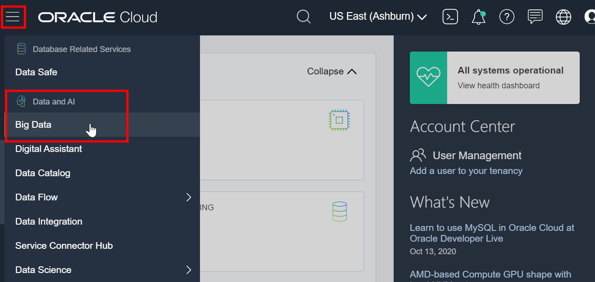

    <if type="livelabs">
4. On the **Clusters** page, click **Create Cluster**.

  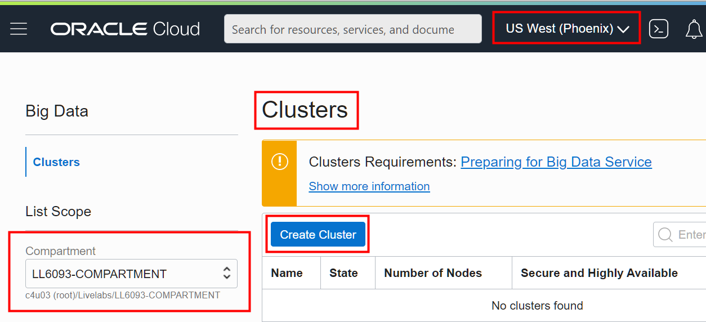

  **Important:** If your assigned LiveLabs compartment is not selected on this page, click the **Compartment** drop-down list in the **List Scope** section on the left. Enter your assigned compartment name in the **Compartment** text field to search for it. When your compartment is displayed in the list of compartments, select it.

    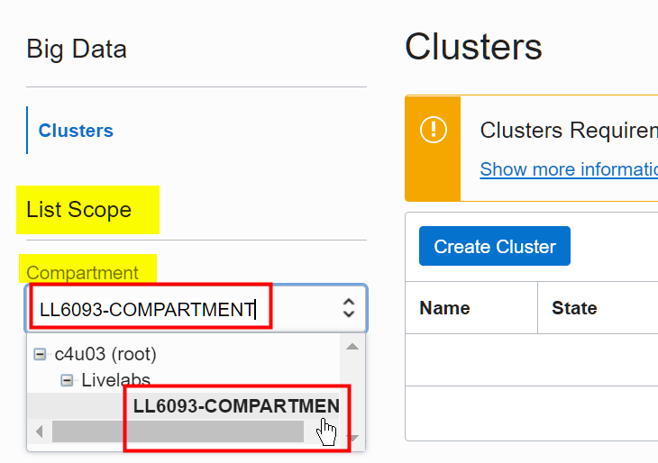

    In addition, make sure that your LiveLabs assigned region from the **Launch Workshop** page is selected in Console's banner, **US West (Phoenix)** in our example.

    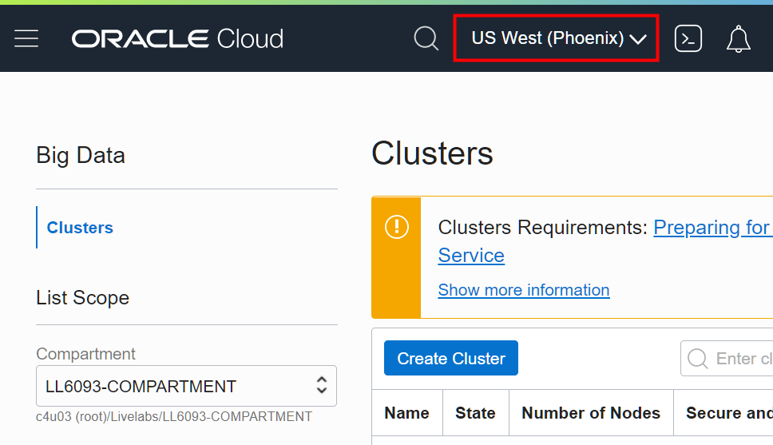
   </if>    

   <if type="freetier">

5. On the **Clusters** page, click **Create Cluster**.

     

     **Note:** If your compartment is not selected, click the **Compartment** drop-down list in the **List Scope** section on the left. Enter your compartment's name in the **Compartment** text field to search for it. When your compartment is displayed in the list of compartments, select it.
    </if>

6. At the top of the **Create Cluster** wizard, provide the cluster details as follows:
    * **Cluster Name:** **`training-cluster`**.
    * **Cluster Admin Password:** Enter a `cluster admin password` of your choice such as **`Training123`**.
    **Important:** You'll need this password to sign into Cloudera Manager and to perform certain actions on the cluster through the Cloud Console.
    * **Confirm Cluster Admin Password:** Confirm your password.
    * **Secure & Highly Available (HA):** Un-check this checkbox since you are creating a simple non-HA cluster and not a secure and HA cluster. A secure cluster has the full Hadoop security stack, including HDFS Transparent Encryption, Kerberos, and Apache Sentry. This setting can't be changed for the life of the cluster.
    * **Cluster Version:** This read-only field displays the latest version of Cloudera 6 that is available to Oracle which is deployed by BDS.

    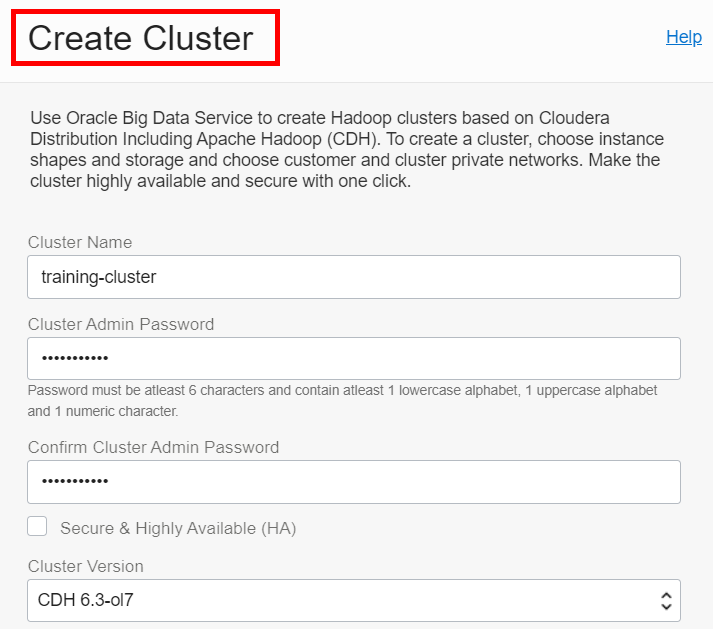

7. In the **Hadoop Nodes > Master/Utility Nodes** section, provide the following details:

    * **Choose Instance Type:** **``Virtual Machine``**.
    * **Choose Master/Utility Node Shape:** **`VM.Standard2.4`**.
    * **Block Storage size per Master/Utility Node (in GB):** **`150 GB`**.
    * **Nunmber of Master & Utility Nodes** _Read-Only_ **:** Since you are creating a non-HA cluster, this field shows **2** nodes: **1** Master node and **1** Utility node.
    **Note:** For an HA cluster, this field would show **4** nodes: **2** Master nodes and **2** Utility nodes.

    

    **Note:** For information on the supported cluster layout, shape, and storage, see [Plan Your Cluster](https://docs.oracle.com/en/cloud/paas/big-data-service/user/plan-your-cluster.html#GUID-0A40FB4C-663E-435A-A1D7-0292DBAC9F1D) in the Using Oracle Big Data Service documentation.

8. In the **Hadoop Nodes > Worker Nodes** section, provide the following details:

    * **Choose Instance Type:** **`Virtual Machine`**.
    * **Choose Worker Node Shape:** **`VM.Standard2.1`**.
    * **Block Storage size per Worker Node (in GB):** **`150 GB`**.
    * **Number of Worker Nodes:** **`3`**. This is the minimum allowed for a cluster.

    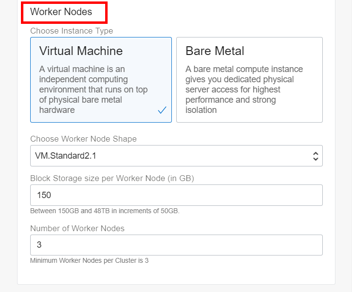

9. In the **Network Setting > Cluster Private Network** section, provide the following details:

     * **CIDR BLOCK:** **`10.1.0.0/24`**. This CIDR block assigns a range of **`256`** contiguous IP addresses, **`10.1.0.0`** to **`10.1.0.255`**. The IP addresses will be available for the cluster's private network that BDS creates for the cluster. This private network is created in the Oracle tenancy and not in your customer tenancy. It is used exclusively for private communication among the nodes of the cluster. No other traffic travels over this network, it isn't accessible by outside hosts, and you can't modify it once it's created. All ports are open on this private network. This

     <if type="freetier">
     **Note:** Use the above CIDR block instead of the already displayed CIDR block range to avoid any possible overlapping of IP addresses with the CIDR block range for the **`training-vcn`** VCN that you created in **Lab 1**.
     </if>

10. In the **Network Setting > Customer Network** section, provide the following details:

    <if type="livelabs">
    * **Choose VCN in _`LiveLabs-assigned-compartment`_:** This is the VCN that you was assigned to you by **`LiveLabs`**. The VCN must contain a regional subnet.   **Note:** If your assigned LiveLabs compartment is not selected, click the _**Change Compartment_** link, and then search for and select your LiveLabs assigned compartment.
    * **Choose Regional Subnet in _`LiveLabs-assigned-compartment`_:** _**`LiveLabs-assigned-Public-Subnet`**_. This is the public subnet that was assigned to you by LiveLabs. Click this drop-down list to select your assigned LiveLabs public subnet.
    </if>

    <if type="freetier">
    * **Choose VCN in `training-compartment`:** **`training-vcn`**. This is the VCN that you created in **Lab 1**. The VCN must contain a regional subnet.   **Note:** Make sure that **`training-compartment`** is selected; if it's not, click the _Change Compartment_ link, and then search for and select your **`training-compartment`**.
    * **Choose Regional Subnet in `training-compartment`:** **`Public Subnet-training-vcn`**. This is the public subnet that was created for you when you created your **`training-vcn`** VCN in **Lab 1**.
    </if>

    * **Networking Options:** **`Deploy Oracle-managed Service gateway and NAT gateway (Quick Start)`**. This simplifies your network configuration by allowing Oracle to provide and manage these communication gateways for private use by the cluster. These gateways are created in the Oracle tenancy and can't be modified after the cluster is created.
    </if>
    **Note:** Select the **`Use the gateways in your selected Customer VCN (Customizable)`** option if you want more control over the networking configuration.

    <if type="freetier">
    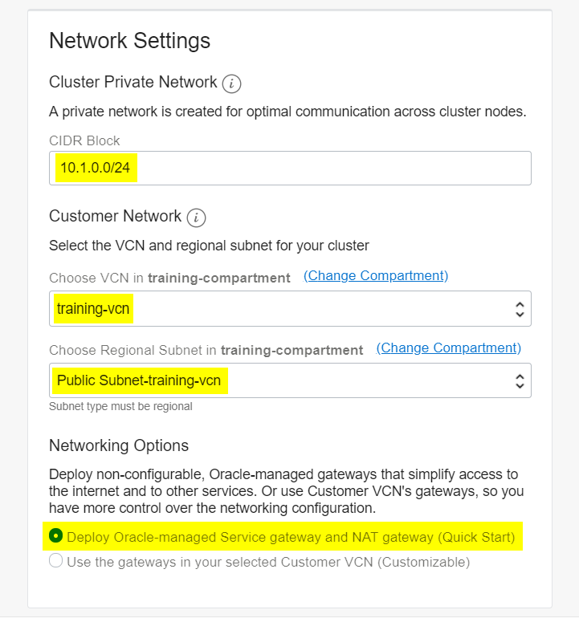
    </if>

    <if type="livelabs">
    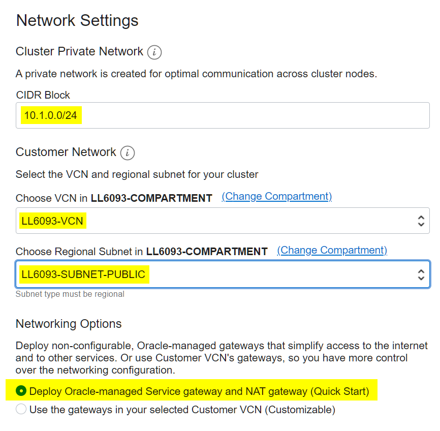
    </if>

11. In the **Additional Options > SSH public key** section, associate a public Secure Shell (SSH) key with the cluster.

    Linux instances use an SSH key pair instead of a password to authenticate a remote user. A key pair file contains a private key and public key. You keep the private key on your computer and provide the public key when you create an instance. When you connect to the instance using SSH, you provide the path to the private key in the SSH command. Later in **Lab 6**, you will connect to your cluster's master node using the private SSH key that is associated with the public SSH key that you specify here for your cluster.

    **Note:** If you already have an existing public key, you can use it in this step; you don't have to create a new public key. If you need to create a new SSH key pair (using different formats), see the [Creating a Key Pair](https://docs.cloud.oracle.com/en-us/iaas/Content/GSG/Tasks/creatingkeys.htm?Highlight=ssh%20key#CreatingaKeyPair) OCI documentation topic and the
    [Generate SSH key](https://oracle.github.io/learning-library/common/labs/generate-ssh-key/) lab.

    Specify an SSH public key using one of the following methods:
     * Select **Choose SSH public key file**, and then either Drag and drop a public SSH key file into the box,
      or click the **Select one...** link, and navigate to and choose a public SSH key file from your local file system.
     * Select **Paste SSH public key**, and then paste the contents from a public SSH key file into the box.

     **Note:** In this lab, we use our own SSH public key pair that we created using Windows **PuTTYgen** named `mykey.pub`. In **Lab 6**, we will connect to our cluster using Windows **PuTTY** and provide the SSH private key named `mykey.ppk` which is associated with our `mykey.pub` public key. If you create OpenSSH key pair using your Linux system or Windows PowerShell, you cannot use PuTTY to connect to your cluster; instead, you will need to use your Linux system or Windows PowerShell. PuTTY uses a different key file format than OpenSSH. To connect to your instance using SSH from a Unix-style system or from a Windows system using OpenSSH, see the [Connecting to Your Instance](https://docs.cloud.oracle.com/en-us/iaas/Content/GSG/Tasks/testingconnection.htm?Highlight=connect%20to%20an%20instance%20using%20ssh) OCI documentation.

     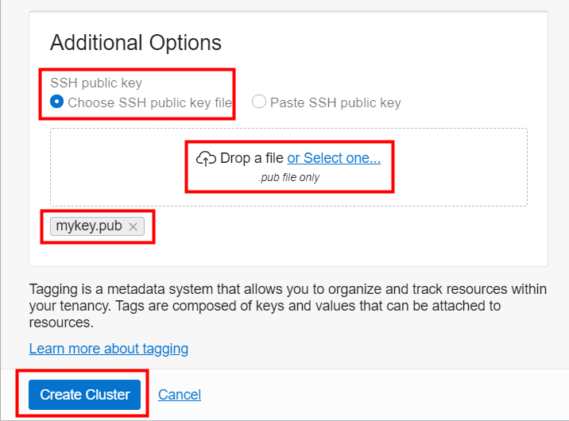

12.  Click **Create Cluster**. The **Clusters** page is re-displayed. The state of the cluster is initially **Creating**.

    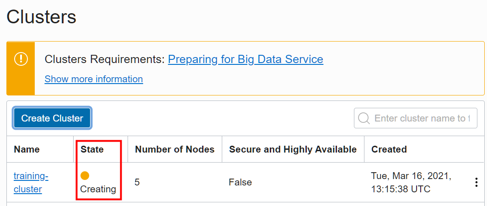

## **STEP 2:** Monitor the Cluster Creation

The process of creating the cluster takes approximately one hour to complete; however, you can monitor the cluster creation progress as follows:

1. To view the cluster's details, click **`training-cluster`** in the **Name** column to display the **Cluster Details** page.

   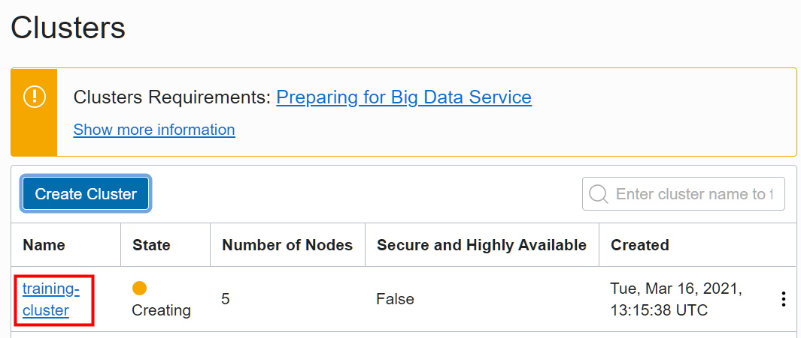

   The **Cluster Information** tab displays the cluster's general and network information.
   <if type="livelabs">
   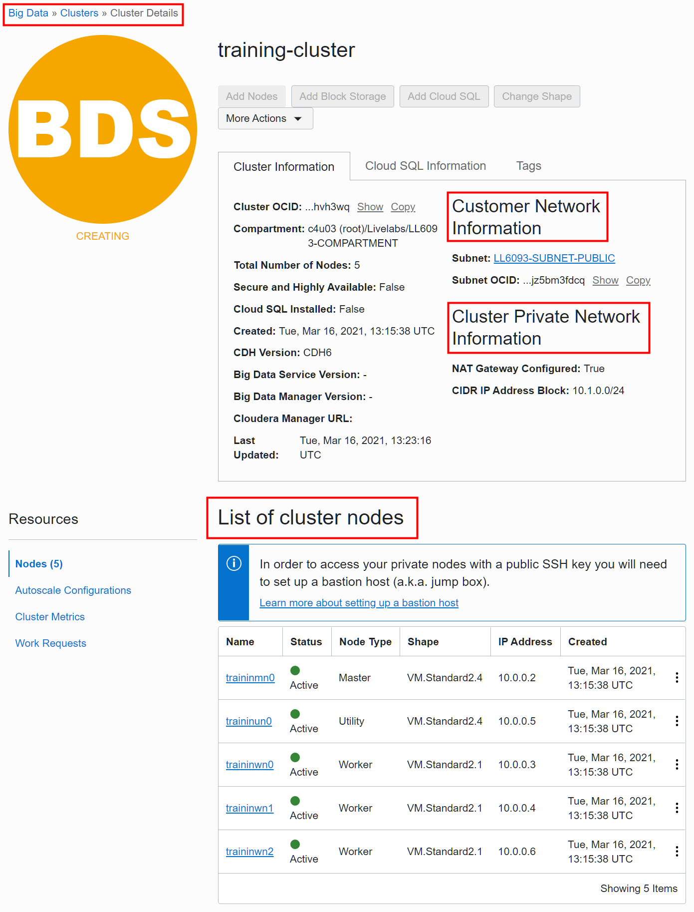  
   </if>
   <if type="freetier">
   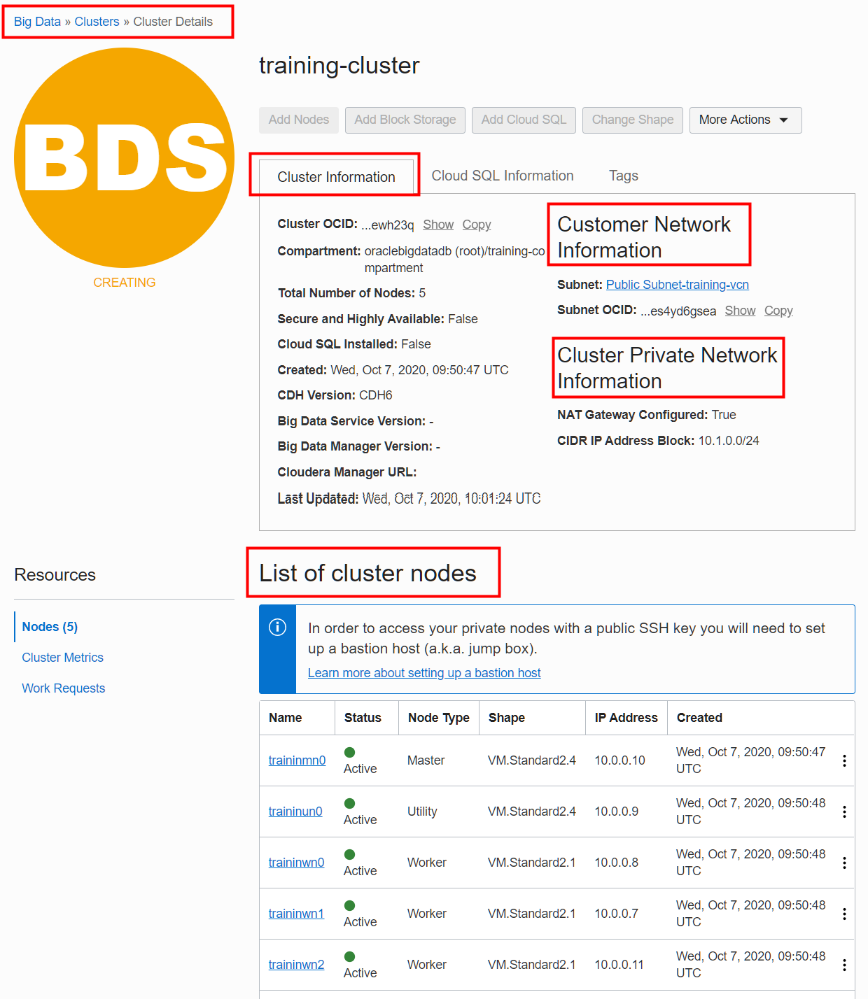  
   </if>

   The **List of cluster nodes** section displays the following information for each node in the cluster: Name, status, type, shape, private IP address, and date and time of creation.

   **Note:**
   The name of a node is the concatenation of the **first seven** letters of the cluster's name, **`trainin`**, followed by two letters representing the node type such as **`mn`** for a **Master** node, **`un`** for a **Utility** node, and **`wn`** for a **Worker** node. The numeric value represents the node type order in the list such as Worker nodes **`0`**, **`1`**, and **`2`**.

   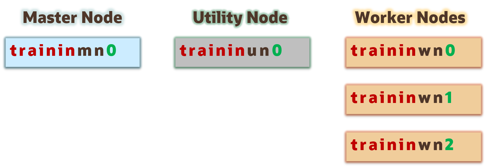

2. To view the details of a node, click the node's name link in the **Name** column. For  example, click the **`traininmn0`** first Master node in the **Name** column to display the **Node Details** page.

    <if type="freetier">
      
    </if>

    <if type="livelabs">
       
    </if>

   The **Node Information** tab displays the node's general information and the network information.

   <if type="freetier">   
   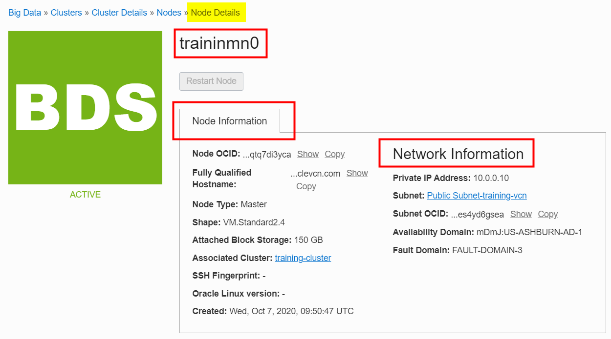  
   </if>

   <if type="livelabs">
   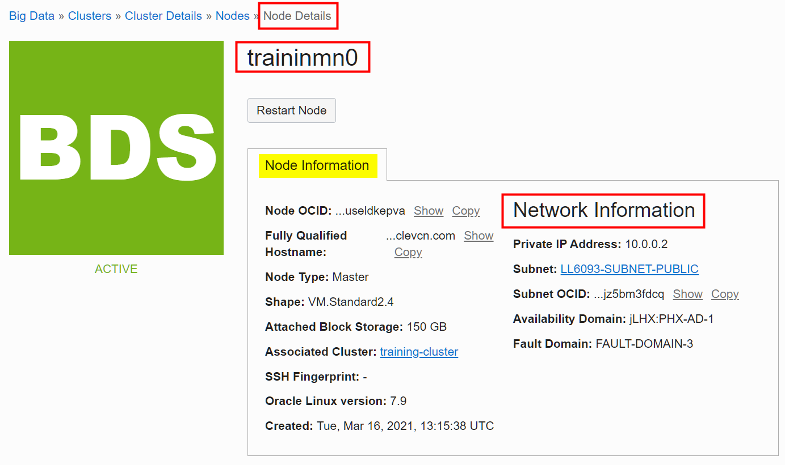  
   </if>

   The **Node Metrics** section at the bottom of the **Node Details** page _is displayed after the cluster is provisioned_. It displays the following charts: **CPU Utilization**, **Memory Utilization**, **Network Bytes In**, **Network Bytes Out**, and **Disk Utilization**. You can hover over any chart to get additional details.

   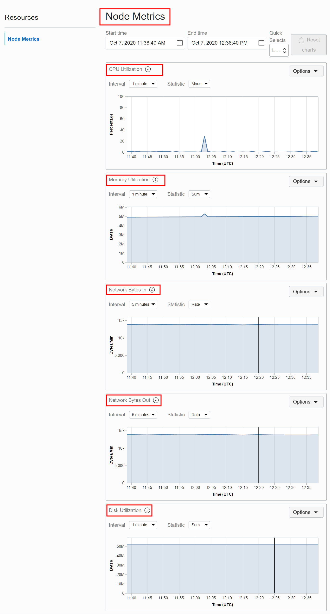  

3. Click the **Cluster Details** link in the breadcrumbs at the top of the page to re-display the **Cluster Details** page.

     

4. In the **Resources** section on the left, click **Work Requests**.

     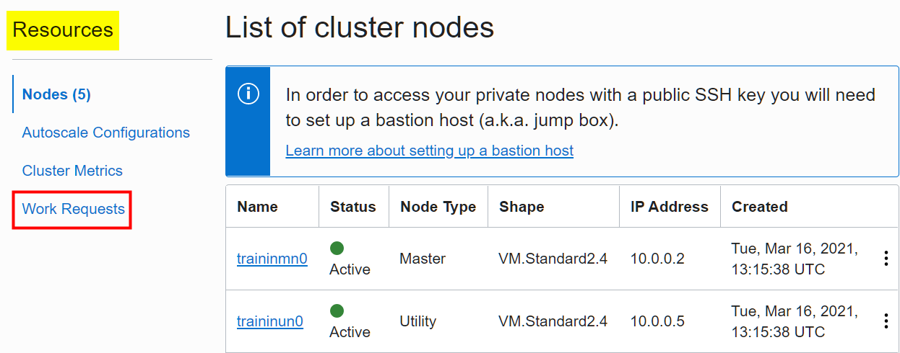  

5. The **Work Requests** section on the page displays the status of the cluster creation and other details such as the **Operation**, **Status**, **% Complete**, **Accepted**, **Started**, and **Finished**. Click the **CREATE_BDS** name link in the **Operation** column.

   

   The **CREATE_BDS** page displays the work request information, logs, and errors, if any.

   

6. Click the **Clusters** link in the breadcrumbs at the top of the page to re-display the **Clusters** page.

      

7. Once the **`training-cluster`** cluster is created successfully, the status changes to **Active**.   

  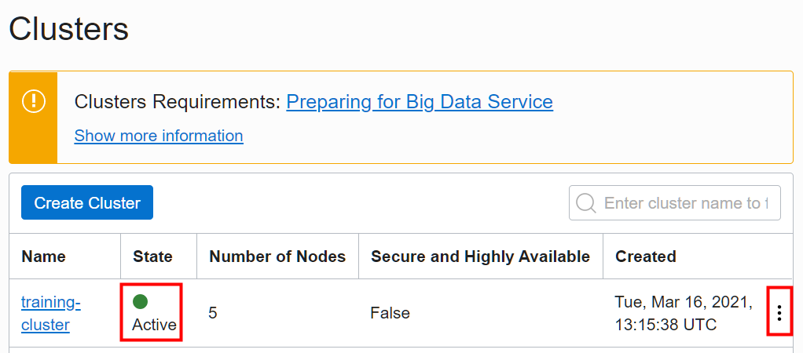  

_**Note:**_  
_If you are using a Free Trial account to run this workshop, Oracle recommends that you delete the BDS cluster when you complete the workshop to avoid unnecessary charges._    

## **STEP 3:** Review Locations of Services in the Cluster

  The `training-cluster` cluster is a highly available (HA) cluster; therefore, the services are distributed as follows:

**Master Node, `traininmn0`:**

  + HDFS Balancer
  + HDFS NameNode    
  + Hive Gateway    
  + Spark Gateway
  + Spark History Server
  + YARN (MR2 Included) JobHistory Server
  + YARN (MR2 Included) ResourceManager
  + ZooKeeper Server

**Utility Node, `traininun0`:**

  + HDFS HttpFS
  + HDFS SecondaryNameNode
  + Hive Gateway
  + Hive Metastore Server
  + HiveServer2
  + Hive WebHCat Server
  + Hue Load Balancer
  + Hue Server
  + Cloudera Management Service Alert Publisher
  + Cloudera Management Service Event Server
  + Cloudera Management Service Host Monitor
  + Cloudera Management Service Navigator Audit Server
  + Cloudera Management Service Navigator Metadata Server
  + Cloudera Management Service Reports Manager
  + Cloudera Management Service Service Monitor
  + Oozie Server
  + Spark Gateway
  + YARN (MR2 Included) Gateway
  + ZooKeeper Server

**Worker nodes, `traininwn0`, `traininwn1`, `traininwn2`:**

  + HDFS DataNode  
  + Hive Gateway
  + Spark Gateway
  + YARN (MR2 Included) NodeManager
  + ZooKeeper Server

**Notes:**
+ In **Lab 5, Use Cloudera Manager (CM) and Hue to Access a BDS Cluster**, you will use Cloudera Manager to view the roles, services, and gateways that are running on each node in the cluster.

This concludes this lab. You may now [proceed to the next lab](#next).

## Want to Learn More?

* [Using Oracle Big Data Service](https://docs.oracle.com/en/cloud/paas/big-data-service/user/index.html)
* [Oracle Cloud Infrastructure Documentation](https://docs.cloud.oracle.com/en-us/iaas/Content/GSG/Concepts/baremetalintro.htm)
* [Creating a Key Pair](https://docs.cloud.oracle.com/en-us/iaas/Content/GSG/Tasks/creatingkeys.htm?Highlight=ssh%20key#CreatingaKeyPair)
* [Connecting to Your Instance](https://docs.cloud.oracle.com/en-us/iaas/Content/GSG/Tasks/testingconnection.htm?Highlight=connect%20to%20an%20instance%20using%20ssh)
* [Overview of Oracle Cloud Infrastructure Identity and Access Management](https://docs.cloud.oracle.com/en-us/iaas/Content/Identity/Concepts/overview.htm)
* [Overview of the Compute Service](https://docs.cloud.oracle.com/en-us/iaas/Content/Compute/Concepts/computeoverview.htm)  
* [Compute Shapes](https://docs.cloud.oracle.com/en-us/iaas/Content/Compute/References/computeshapes.htm#vm-dense)

## Acknowledgements

* **Author:**  
    + Lauran Serhal, Principal User Assistance Developer, Oracle Database and Big Data User Assistance
* **Contributors:**  
    + Martin Gubar, Director, Oracle Big Data Product Management
    + Ben Gelernter, Principal User Assistance Developer, DB Development - Documentation
* **Last Updated By/Date:** Lauran Serhal, March 2021

