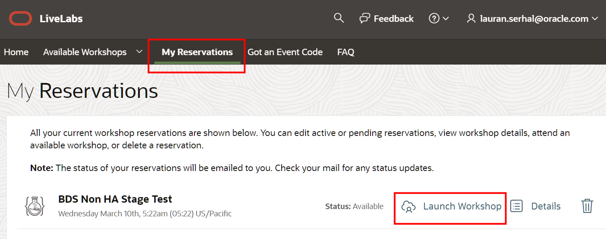
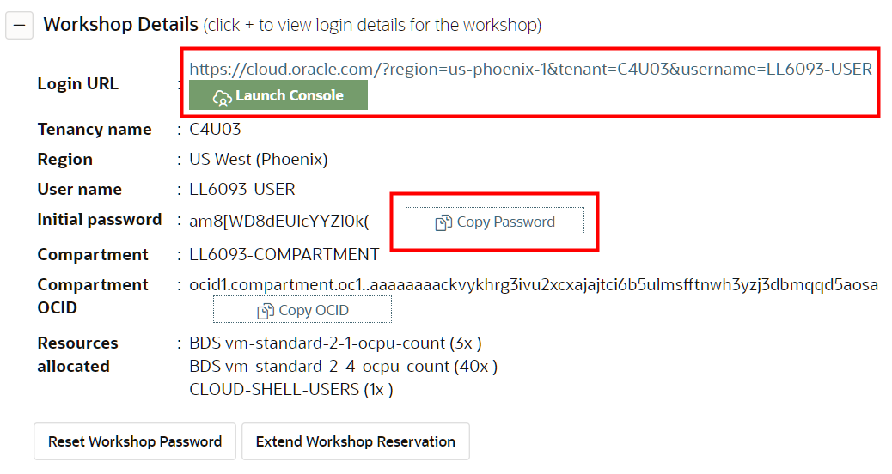
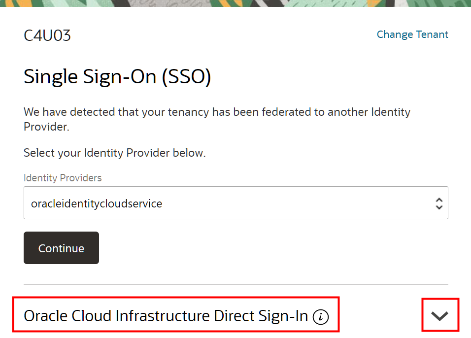

# Workshop Introduction and Overview                                    

The labs in this workshop walk you through all the steps to get started using **Oracle Big Data Service (BDS)**.

Estimated Workshop Time: 4 hours

## What is Oracle Big Data Service?
Oracle Big Data Service is an Oracle Cloud Infrastructure service designed for a diverse set of big data use cases and workloads. From short-lived clusters used to tackle specific tasks to long-lived clusters that manage large data lakes, Big Data Service scales to meet an organization’s requirements at a low cost and with the highest levels of security.

* Vertically integrated for Hadoop, Kafka, and Spark using Cloudera Enterprise Data Hub.
* Highly secure and highly available clusters provisioned in minutes.
* Expand on premise Hadoop; deploy test and development to the cloud.
* Any scale using high performance bare metal or cost effective virtual machine (VM) shapes.
* End-to-end data management; use with Autonomous Database, Analytics Cloud, OCI Streaming, OCI Data Catalog, OCI Data Science, and OCI Data Flow.
* Use Oracle SQL to query across Hadoop, Object Stores, Kafka, and NoSQL with Cloud SQL.

Watch our short video that explains key features in Oracle Big Data Service:

## Workshop Objectives
- Review how to create some OCI resources that are required to get started with BDS.
- Create a simple (non-HA) Cloudera Distribution Including Apache Hadoop (CDH) Oracle BDS cluster using the Oracle Cloud Infrastructure Console (OCI) and Big Data Service (BDS).
- Add Cloud SQL to the cluster and maintain your cluster.
- Access a BDS utility node using a public IP address.
- Use Cloudera Manager (CM) and Hue to access a Big Data Service (BDS) cluster and add ingress security rules to the default security rule that enables you to access both CM and Hue.
- Map the private IP address of the first master node in your cluster to a new public IP address to make this node publicly available on the internet and create a Hadoop Administrator user.
- Upload data to Hadoop Distributed File System.
## Lab Breakdown
- **Lab 1:** Review Creating BDS Environment Resources (Optional)
- **Lab 2:** Create a BDS Hadoop Cluster
- **Lab 3:** Add Oracle Cloud SQL to the Cluster
- **Lab 4:** Access a BDS Utility Node Using a Public IP Address
- **Lab 5:** Use Cloudera Manager and Hue to Access a BDS Cluster
- **Lab 6:** Create a Hadoop Administrator User
- **Lab 7:** Upload Data to Hadoop Distributed File System (HDFS)

## Workshop Prerequisites
This workshop requires an active *Oracle account* and a LiveLabs reservation as described in the **Prerequisites** lab in the **Contents** menu.

## Launch the Workshop

_**Note:** It can take up to 20 minutes to create your workshop environment._

1. When your LiveLabs workshop reservation is ready, you will receive an email with the subject **Your Livelabs reservation has been created (event #)**.

    

2. On the LiveLabs Home page, click the **My Reservations** tab to display your reserved workshop on the **My Reservations** page. To start the workshop, click **Launch Workshop**.

    

    The **Launch *workshop-name* Workshop** page is displayed in a new browser tab named **Attend the Workshop**. The **Workshop Details** section contains important information that you will need throughout this workshop.  

    

    **Note:** The **Let's Get Started - Log in to Oracle Cloud** section on the page displays helpful information on how to log in to the Console using your reserved environment.

3. Click **Copy Password** to copy your initial password, and then click **Launch Console** or click the **Login URL**.

    

4. On the login page, click the down arrow next to **Oracle Cloud Infrastructure Direct Sign-In**.

    

5. The **User Name** field displays your assigned username. Paste your initial password in the **Password** field, and then click **Sign In**.

    

6. In the **Change Password** dialog box, enter your initial password in the **Current Password** field. Enter and confirm a new password in the **New Password** and **Confirm New Password** fields respectively, and then click **Save New Password**.     
_**Note:** You can use your initial assigned password as the new password._     

    

7. The **Oracle Cloud Console** Home page is displayed. Make sure that the displayed region is the same that was assigned to you in the **Workshop Details** section of the **Launch *workshop-name* Workshop** page, **US West (Phoenix)** in this example.

    

8. Scroll-down to the bottom of the **Launch *workshop-name* Workshop** page. Click the **Click here to open the next part of the workshop** box to proceed to the next lab in the workshop. In addition, it is recommended that you click the **Open the workshop instructions in a new tab** link for better viewing of the workshop.

    

This concludes this lab. You may now [proceed to the next lab](#next).

**Notes:**
 + For more information about service limits, see [Service Limits](https://docs.cloud.oracle.com/en-us/iaas/Content/General/Concepts/servicelimits.htm) in the Oracle Cloud Infrastructure documentation.
 + To submit a request to increase your service limits, see [Requesting a Service Limit Increase](https://docs.cloud.oracle.com/en-us/iaas/Content/General/Concepts/servicelimits.htm#Requesti) in the Oracle Cloud Infrastructure documentation.

**You are all set to begin the labs in this workshop! Click "Lab 1: Review Creating BDS Environment Resources (Optional)".**

## Want to Learn More About Oracle Big Data Service?

Use these links to get more information about BDS and OCI:

* [Using Oracle Big Data Service](https://docs.oracle.com/en/cloud/paas/big-data-service/user/index.html)
* [Oracle Cloud Infrastructure Documentation](https://docs.cloud.oracle.com/en-us/iaas/Content/GSG/Concepts/baremetalintro.htm)
* [Overview of Oracle Cloud Infrastructure Identity and Access Management (IAM)](https://docs.cloud.oracle.com/en-us/iaas/Content/Identity/Concepts/overview.htm)
* [Oracle Cloud Infrastructure Self-paced Learning Modules](https://www.oracle.com/cloud/iaas/training/foundations.html)
* [Overview of Compute Service](https://www.oracle.com/pls/topic/lookup?ctx=cloud&id=oci_compute_overview)
* [VCN and Subnets](https://docs.cloud.oracle.com/iaas/Content/Network/Tasks/managingVCNs.htm)

## Acknowledgements

* **Authors:**
    * Lauran Serhal, Principal UA Developer, Oracle Database and Big Data User Assistance
    * Martin Gubar, Director, Oracle Big Data Product Management
* **Last Updated By/Date:** Lauran Serhal, March 2021
