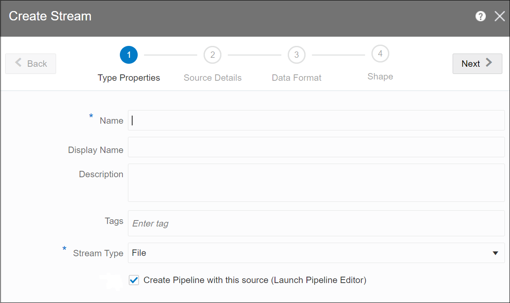
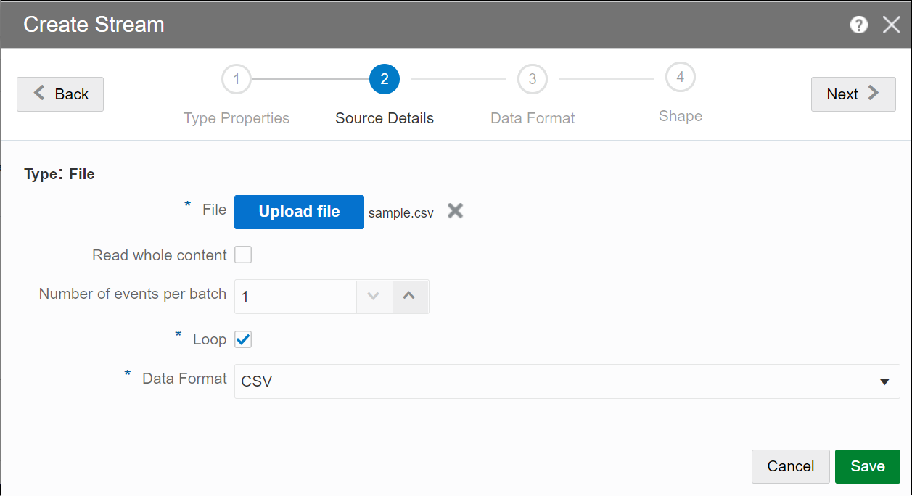
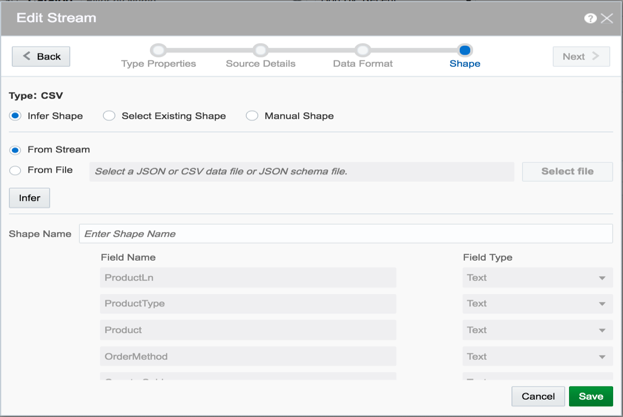
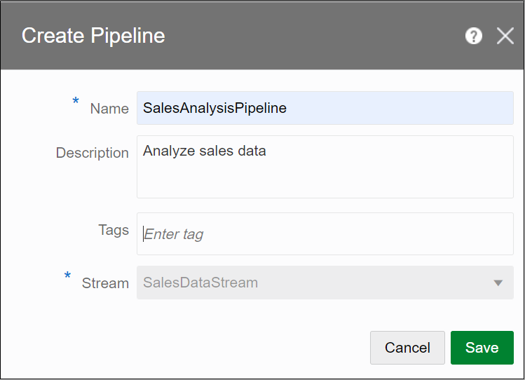
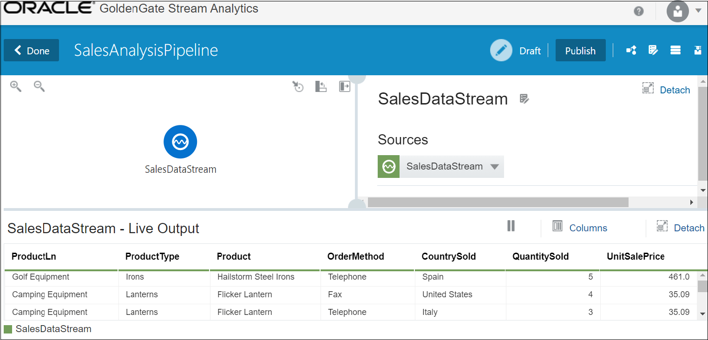
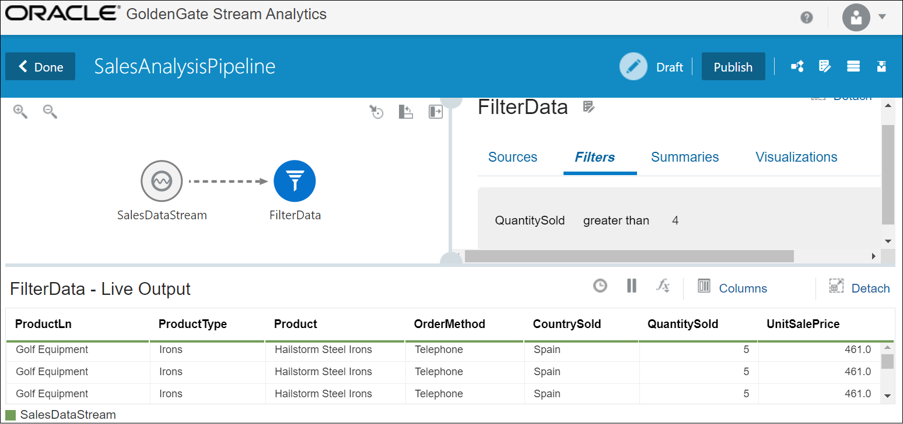

# Create your HelloWorld Pipeline

This lab helps you create a basic pipeline, add a query stage and a filter to it, and publish the pipeline; all this in less than 10 minutes!

### **What is a Pipeline?**

A pipeline includes a sequence of data processing stages such as, Query, Pattern, Rule, Query Group, Custom, and Scoring. You can apply business logic to an input data stream, within a pipeline.

## **Lab Prerequisites**

1. An On-prem or a Marketplace instance of GoldenGate Stream Analytics(GGSA) version 19.1

    * For more information on installing GGSA on-prem, see [Installing GoldenGate Stream Analytics](https://docs.oracle.com/en/middleware/fusion-middleware/osa/19.1/install/how-install-goldengate-stream-analytics.html#GUID-13BC895D-6AD1-4398-98E2-B5BE5B14D26B).
    * For more information on using GGSA on Marketplace, see [GoldenGate Stream Analytics on Oracle Cloud Marketplace](https://docs.oracle.com/en/middleware/fusion-middleware/osa/19.1/osamp/getting-started-goldengate-stream-analytics-oci.html#GUID-B488861E-1C43-4177-A1F8-40F8E44754AD).

2. Mandatory System Settings configured

    * For configuration instructions, see [Mandatory RTE Configurations](https://docs.oracle.com/en/middleware/fusion-middleware/osa/19.1/using/configuring-runtime-environment.html#GUID-EB33DDFD-7444-434D-8944-059564A453FD).

## **STEP 1:** Create a CSV file

Create a CSV file and copy the following lines into it:

* `ProductLn,ProductType,Product,OrderMethod,CountrySold,QuantitySold,UnitSalePrice`
* `Personal Accessories,Watches,Legend,Special,Brazil,1,240`
* `Outdoor Protection,First Aid,Aloe Relief,E-mail,United States,3,5.23`
* `Camping Equipment,Lanterns,Flicker Lantern,Telephone,Italy,3,35.09`
* `Camping Equipment,Lanterns,Flicker Lantern,Fax,United States,4,35.09`
* `Golf Equipment,Irons,Hailstorm Steel Irons,Telephone,Spain,5,461`

## **STEP 2:** Log in to GoldenGate Stream Analytics

Log in to the GoldenGate Stream Analytics using the url, with the following credentials:

* **User Name:** **osaadmin**

* **Password:** **welcome1**

## **STEP 3:** Create a File Stream

1. To create a File stream, on the **Catalog** page, click **Create New Item**, and select **Stream** to display the **Create Stream** screen.

   

2. Select **File** in the **Stream Type** drop-down list.

   

3. Select **Create Pipeline with this source (Launch Pipeline Editor)**.

4. Click **Next**, to update the source details.

## **STEP 4:** Upload the CSV file

1. To upload the CSV file, on the **Source Details** screen, click **Upload File** to browse and upload the CSV file that you had created in **STEP 1**.

   

2. Click **Next**, to display the **Data Format** screen.

## **STEP 5:** Set Record Header

1. To set the first record as header, on the **Data Format** screen, select **First record as header**.

   

2. Click **Next**, to infer shape for the event.

## **STEP 6:** Infer Event Shape

1. To infer shape from stream, on the **Shape** screen, ensure **Infer Shape** and **From Stream** options are selected, and verify if the shape of the event is successfully inferred as shown in following screenshot.

   

2. Click **Save**, to open the **Create Pipeline** screen.

## **STEP 7:** Create Pipeline

1. To create a pipeline, on the **Create Pipeline** screen, enter a name for the pipeline, and click **Save** to launch the Pipeline Editor.

   

## **STEP 8:** View the Pipeline in the Pipeline Editor

1. In the pipeline editor, you will see the message *Starting Pipeline* followed by *Listening to Events*. This is the first access of the cluster, therefore it will take a while to copy the libraries.

2. You should eventually see the following screen, with a single node representing the source stream in the left pane, and the **Sources** used in the pipeline, in right pane.

   

## **STEP 9:** Add a Query Stage

1. To add a **Query** stage to the source stream, right-click on the source stream, select **Add a Stage** and then select **Query**.

2. Enter a **Name** and **Description** for the Query Stage.

3. Click **Save**. A Query stage is added to the source stream.

## **STEP 10:** Add a Filter to the Query Stage

1. To add a **Filter** to a **Query** stage, click **Filters** in the left pane, and click **Add a Filter**. In this example, the filter is **QuantitySold is greater than 4**, as shown in the following screenshot.

   

## **STEP 11:** Publish the Pipeline

1. To publish a pipeline click **Publish** on the top-right corner. Publish with defaults, for your pipeline to filter data in real-time.

**Note:**

* The pipeline would continue to run even after you log out since the pipeline is now in published state.

* By default the Pipeline is in *Draft* state, and quitting the pipeline editor without publishing will remove the pipeline and release all cluster resources.

## Learn More

* [Transform and Analyze Data Streams](https://docs.oracle.com/en/middleware/fusion-middleware/osa/19.1/using/creating-pipeline-transform-and-analyze-data-streams.html#GUID-9DB9B57A-1095-4557-ACB9-816A696EB121)

## Acknowledgements
* **Author** - Pratibha Manjunath, Senior User Assistance Developer, GoldenGate Stream Analytics
* **Contributors** - Prabhu Thukaram, Senior Director, Software Development
* **Reviewers:**
    * Anuradha Chepuri, Principal User Assistance Developer, Oracle GoldenGate
    * Prabhu Thukaram, Senior Director, Software Development, Golden Gate Development
    * Yathish Gatty, Senior Software Development Manager, Golden Gate Development
    * Aslam Khan, Senior User Assistance Manager, ODI, OGG, EDQ

* **Last Updated By/Date** - Pratibha Manjunath, November 2020

## Need Help?
Please submit feedback or ask for help using our [LiveLabs Support Forum](https://community.oracle.com/tech/developers/categories/livelabsdiscussions). Please click the **Log In** button and login using your Oracle Account. Click the **Ask A Question** button to the left to start a *New Discussion* or *Ask a Question*.  Please include your workshop name and lab name.  You can also include screenshots and attach files.  Engage directly with the author of the workshop.

If you do not have an Oracle Account, click [here](https://profile.oracle.com/myprofile/account/create-account.jspx) to create one.
