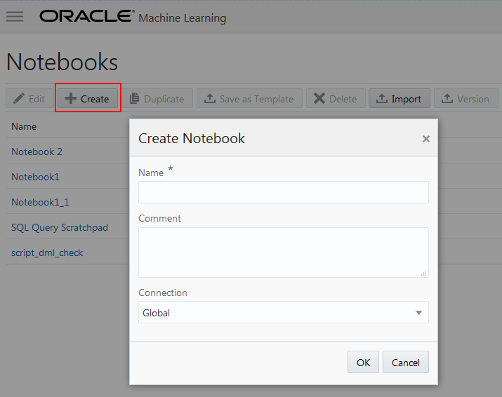
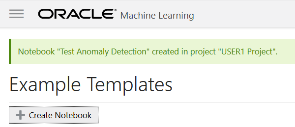
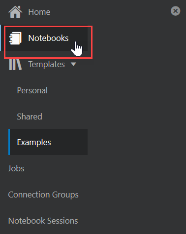
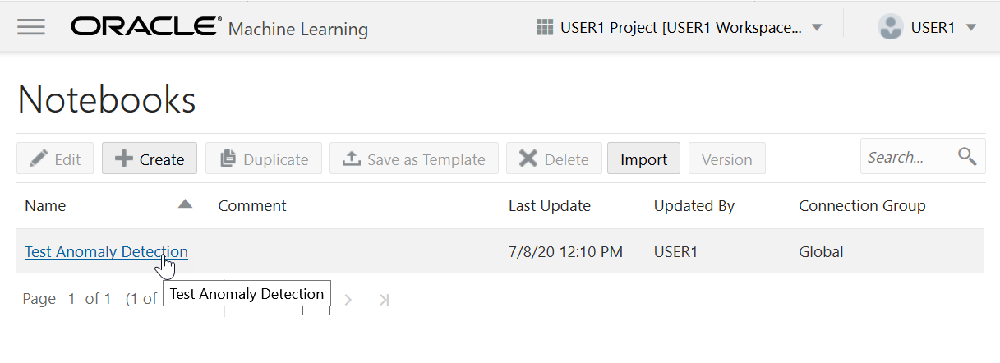
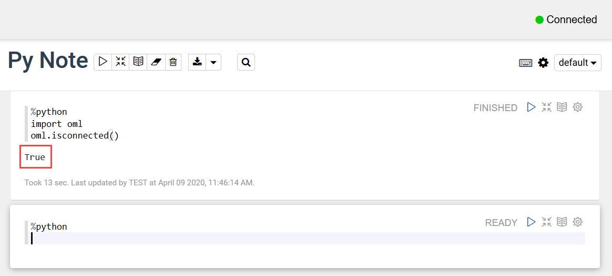
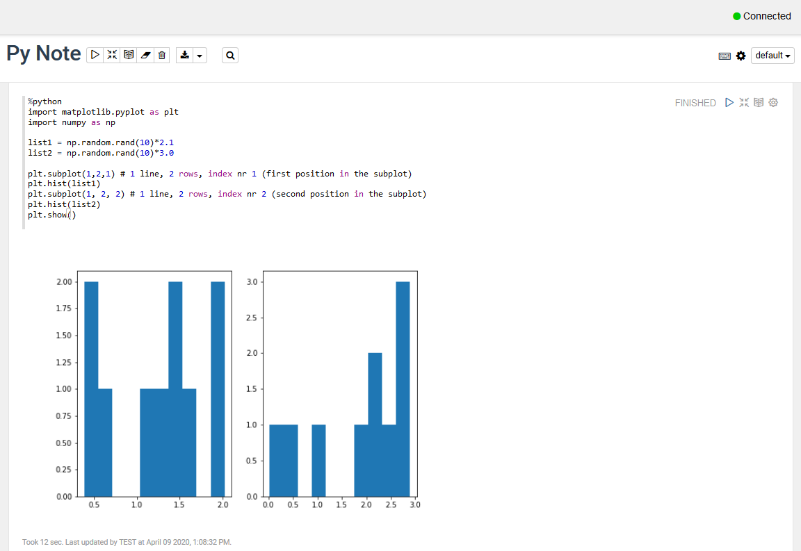

# Oracle® Cloud Create and Run Notebooks in Oracle Machine Learning
## Before You Begin

This lab shows you how to create a notebook and run it in Oracle Machine Learning Notebooks.

This lab takes approximately 10 minutes to complete.

### Background
Oracle Machine Learning Notebooks is a web-based interface for data analysis, data discovery, and data visualization. Whenever a notebook is created, it must be defined with a specific Interpreter Settings specification. The notebook contains an internal list of bindings that determines the order of the interpreter bindings.

A notebook comprises paragraphs which is a notebook component where you can write SQL statements, run PL/SQL scripts, and run Python commands. A paragraph has an input section and an output section. In the input section, specify the interpreter to run along with the text. This information is sent to the interpreter to be executed. In the output section, the results of the interpreter are provided.

### What Do You Need?

* Access to your Oracle Machine Learning Notebooks account
* A project created in your Oracle Machine Learning Notebooks account, where the notebook will reside

## Create Your Notebook

To create a notebook:

1. Log in to your Oracle Machine Learning account and click **Notebooks** in the home page.

   

2. In the Notebooks page, click **Create**. The Create Notebook dialog box opens.

   

3. In the **Name** field, provide a name for the notebook.

4. In the **Comments**field, enter comments if any.

5. The **Connection** field specifies the Global connection group.

6. Click **OK**. Your notebook is created and it opens in the notebook editor. You can now use it to run SQL statements, run PL/SQL scripts, and run Python commands. To do so, specify any one of the following directives in the input section of the paragraph:

    * `%sql` - To run SQL statements
    * `%script` - To run PL/SQL scripts
    * `%python` - To run Python scripts

7. Click **Back** to return to the Notebooks page, and to save the changes in the notebook.

## Create Your Notebook From Templates

To create a notebook based on a template:

1. Log in to your Oracle Machine Learning account and click **Examples** in the home page.

    

2. On the Examples Template page, click the example template based on which you want to create your notebook and then click **Create Notebook**.  Note that clicking the notebook name opens a read-only notebook so that you can see the contents. Clicking anywhere else on the template box selects the template and then **Create Notebook** is enabled. In this example, the user clicks **Anomaly Detection** example template. The Create Notebook dialog box opens.

    

3. In the Create Notebook dialog, enter the following details:
     * **Name**: Enter a name for the notebook. In this example, the user Test Anomaly Detection
     * **Comment**: Enter comments, if any.
     * **Project**: Click the pencil icon to navigate and select the project in which you want to save the notebook. In this example, the notebook is saved in the default USER1 Project inside USER1 Workspace.
     * **Connection**: By default, the connection is set to Global.

     

4. Click **OK**. Once the notebook is created successfully, a message appears stating that the notebook is created in the project. The newly created notebook is listed in the Notebooks page.

     

5. To open the notebook, click **Notebooks** in the left navigation menu.

     

6. In the Notebooks page, click **Test Anomaly Detection**. The notebook opens in the notebook editor. You are now ready to edit and run the notebook. This completes the task of creating a notebook based on an Example Template.

     

## Run Your Notebook with Python Interpreter

Oracle Machine Learning for Python (OML4Py) enables you to run Python commands and scripts for data transformations and for statistical, machine learning, and graphical analysis on data accessible as tables and views.  

This example assumes that you have a notebook called Py Note notebook created. To run a Python script:

1. Open the Py Note notebook.

2. You must specify the Python interpreter to execute Python scripts in notebooks. Type %python and press enter. This specification, indicates that the paragraph should be executed by the Python interpreter.

   

3. To use OML4Py, you must first import the `oml` module. `oml` is the OML4Py module that allows you to manipulate Oracle Database objects such as tables and views, invoke user-defined Python functions using embedded execution, and use the database machine learning algorithms. Type the following commands and click the **Run** icon. Alternatively, you can press **Shift+Enter** keys to run the paragraph.   

  `import oml` 
  `oml.isconnected()`

   

   In this example, the commands:

     * `import oml`- Imports the OML4Py module
     * `oml.isconnected()` - Returns the following values:

        * TRUE - Indicates that the `oml` module is connected to the Oracle Database
        * FALSE - Indicates that the `oml` module is not connected to the Oracle Database

4. Once the `oml` module is connected to the Oracle Database, the command returns `TRUE`. On Oracle Autonomous Database, if the interpreter bindings are properly specified, this should always return `TRUE` as the database connection is established by the OML Notebook environment automatically. You are now ready to run python commands in your notebook.

   

   Click . Alternatively, you can press **Shift+Enter** keys to run the notebook.

5. Type the following Python code and click the run icon.   

   `import matplotlib.pyplot as plt` 
    `import numpy as np`

    `list1 = np.random.rand(10)*2.1` 
    `list2 = np.random.rand(10)*3.0`

    `plt.subplot(1,2,1) # 1 line, 2 rows, index nr 1 (first position in subplot)` 
    `plt.hist(list1)` 
    `plt.subplot(1, 2, 2) # 1 line, 2 rows, index nr 2 (second position in subplot)` 
    `plt.hist(list2)` 
    `plt.show()`  

    In this example, the commands import two python packages to compute and render the data in two histograms for list1 and list2. The Python packages are:

    * `Matplotlib` - Python package to render graphs.
    * `Numpy` - Python package for computations.

     

6. The graphs for list1 and list 2 are generated by the python engine.     

       

7. Click **Back** to return to the Notebooks page.

## Run Your Notebook with SQL Interpreter

To display and visualize data using SQL in a notebook paragraph, that data must be fetched from the database.

Paragraphs using the SQL (%sql) and PL/SQL (%script) interpreters allow users to invoke Oracle SQL and PL/SQL statements, respectively. Users invoke OML4SQL machine learning functionality in such paragraphs as well. The notebook offers the functionality to perform charting on the SQL interpreter output that is returned to the notebook. The options in the chart settings to perform groupings, summation, and other operations are done in the notebook server, and not in the database server. For example, if you want to run a Group By on all your data, then it is recommended to use SQL scripts to do the grouping in the database, and return the summary information for charting in the notebook. Grouping at the notebook level works well for small sets of data. If you pull a lot of data into the notebook, then you may encounter memory limitations. You can set the row limit for your notebook by using the option Render Row Limit to control how many rows are allowed to be returned from the database, with the default being the first 1000 rows in the Connection Group page.

To run a notebook:

1. Click the notebook that you want to run. The notebook opens in the Notebook editor.

2. Type the SQL statement to fetch data from an Oracle Database. For example, type `SELECT * from SH.SALES;` where `SH` is the schema name and `SALES` is the table name as shown in the screenshot.

   

   Click . Alternatively, you can press **Shift+Enter** keys to run the notebook.

3. After you run the notebook, it fetches the data in the notebook in the next paragraph, as shown in the screenshot.

       

   The output section of the paragraph has a charting component that displays the results in graphical output. The chart interface allows you to interact with the output in the notebook paragraph. You have the option to run and edit single a paragraph or all paragraphs in a notebook. In this screenshot, you can see the data from the `SALES` table in a scatter plot.

       

   You can visualize the data by clicking the respective icons for each graphical representation, as shown here:

      * Click the histogram icon  to visualize your data in a histogram.
      * Click the pie chart icon  to visualize your data in a pie chart.
      * Click the cumulative gain chart icon  to visualize your data in a cumulative gain chart.
      * Click the line diagram icon  to visualize your data in a line diagram.
      * Click the scatter plot icon  to visualize your data in a scatter plot.

4. Click **Back** to return to the Notebooks page.

## Acknowledgements

* **Author** : Mark Hornick, Sr. Director, Data Science / Machine Learning PM, Moitreyee Hazarika, Principal User Assistance Developer, DB Development - Documentation

* **Last Updated By/Date**: Dimpi Sarmah, September 2020

See an issue?  Please open up a request [here](https://github.com/oracle/learning-library/issues).   Please include the workshop name and lab in your request.
