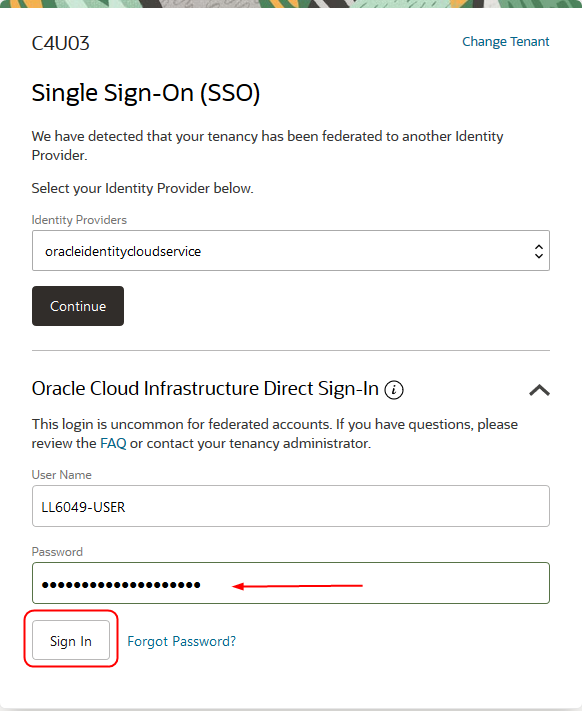
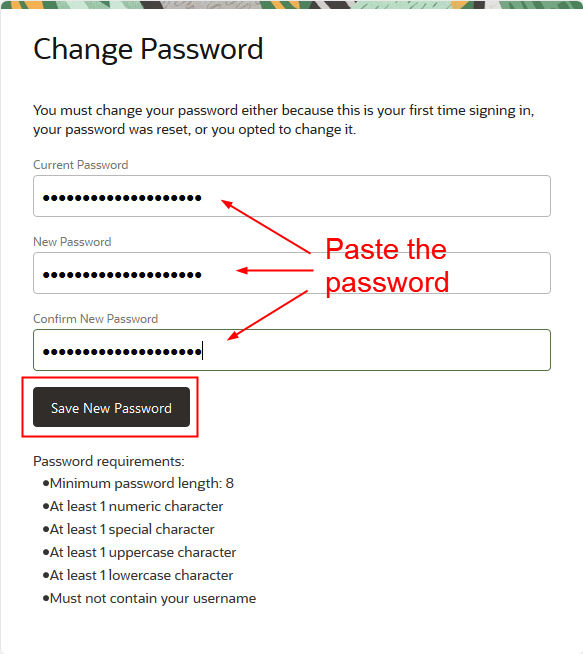

# Introduction

## About this Workshop

In this workshop, you will explore how to pick a good wine for under $30 using Oracle Autonomous Database, Oracle Machine Learning and the Oracle Analytics Cloud with a simple use case.

Estimated Lab Time: 90 minutes

### About Product/Technology

**Oracle Machine Learning** extends Oracle Database and enables users to build “AI” applications and analytical dashboards. OML delivers powerful in-database machine learning algorithms, automated ML functionality via SQL APIs and integration with open source Python and R.

To select a good inexpensive wine, you will:
- Use the Oracle Machine Learning Notebook to:
    - Understand the Business Problem
    - Explore Data
    - Identify Key Attributes
    - Build and Test Predictive Machine Learning Models
    - Apply Machine Learning Models for Predictions
- Further investigate insights and predictions using Oracle Analytics Cloud, Interactive analytics, charts and more.

### Workshop Scenario

Let's take a scenario where we are invited to a party and want to bring something to contribute. A bottle of wine is always a good option. But which one? There are so many! And we don't want to break the bank for our party gift. Let's try to use the Autonomous Database, Oracle Machine Learning and Oracle Analytics Cloud to find a likely tasty and likely to be rated greater than 90 Points (GT\_90\_Points) adult beverage that is also affordable (Under $30).

Note:  Data comes from Kaggle WineReviews130K data = 130k wine reviews with variety, location, winery, price, etc. Points was binned to GT\_90\_Points and LT\_90\_Points  [https://www.kaggle.com/zynicide/wine-reviews](https://www.kaggle.com/zynicide/wine-reviews)

Using Wine Reviews data from Kaggle, we build, evaluate and apply Oracle Machine Learning models using random forests and support vector machine classification techniques that identify likely good (GT\_90\_Points) bottles of wine. This demo highlights OML's text mining capabilities and its tight integration with Oracle Analytics Cloud for interactively explore OML's insights and predictions.

### Objectives

In this lab, you will:
* Provision an Oracle Autonomous Database Instance
* Run a Machine Learning Notebook
* Provision an Oracle Analytics Cloud Instance
* Visualize the Data

### Prerequisites

* An Oracle Free Tier, Always Free, Paid or LiveLabs Cloud Account

<if type="livelabs">

## **STEP 1:** Launch the workshop

*Note: It takes approximately 20 minutes to create your workshop environment.*

1. After you receive the e-mail stating that your environment is ready, go back to the My Reservations page and click **Launch Workshop**.

    

2. Make a mental note of the compartment name assigned to you. Click **Copy Password** to copy your initial password. Note that this is also the admin password for your Autonomous Data Warehouse instance, so save the password for later use. Then click **Launch Console**.

    

3. On the login page, use the Oracle Cloud Infrastructure direct sign-in, paste the password and click **Sign In**.

    

4. Change your password by entering your existing password and entering a new password. Note: you can use your existing password as the new password also.

    

5. Click on the menu icon and then select Autonomous Data Warehouse from the menu.

    

6. Select the compartment assigned to you from the **List Scope menu** and then click the ADW instance.

    

    

You may now [proceed to the next lab](#next).

</if>

## Learn More

* [Picking a good inexpensive wine <$30 using Oracle Machine Learning blog](https://blogs.oracle.com/machinelearning/picking-a-good-inexpensive-wine-%3c30-using-oracle-machine-learning)
* [Preview this video about picking a good inexpensive wine using Oracle Machine Learning.](https://www.youtube.com/watch?v=nKDWODevoKQ&t=5s)

## Acknowledgements

* **Author** - Charlie Berger, Senior Director of Product Management, Machine Learning, AI and Cognitive Analytics
* **Contributors** -  Anoosha Pilli & Didi Han, Database Product Management
* **Last Updated By/Date** - Didi Han, Database Product Management,  April 2021