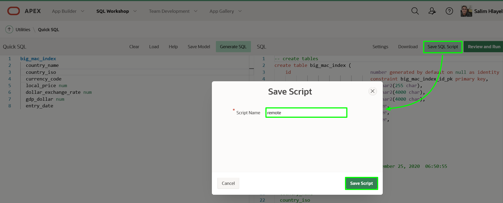
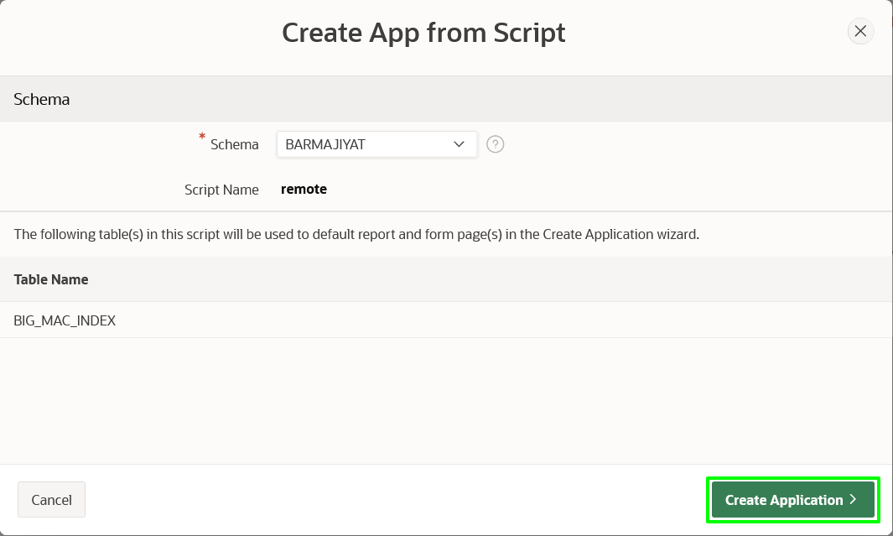
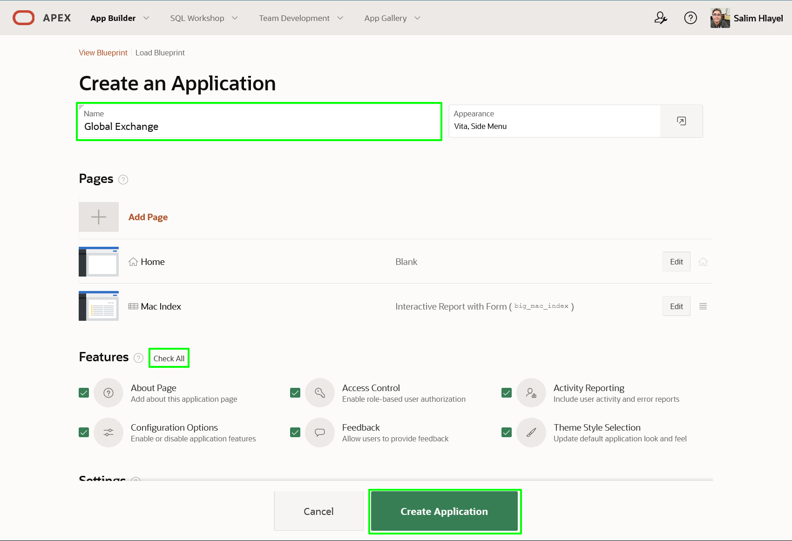

# Creating the Table

## Introduction

In this lab, you will learn how to create a table by defining the data structures in Quick SQL.

Estimated Time: 10 minutes

## **STEP 1** - Open Quick SQL
1. Log into your workspace.
2. Click **SQL Workshop**.
3. Click **SQL Scripts**.

    

4. Click **Quick SQL**.

    

## **STEP 2** - Enter Shorthand for Tables
Quick SQL provides an easy way to generate the SQL required to create a relational data model from an indented text document. This tool is designed to reduce the time and effort required to create SQL tables, triggers, and index structures.

1. In Quick SQL (left pane), enter the following.

    ```
    <copy>big_mac_index  
      country_name  
      country_iso
      currency_code
      local_price num
      dollar_exchange_rate num
      gdp_dollar num
      entry_date</copy>
    ```

    *Note: By indenting the country\_name and subsequent rows, it is indicating that these are columns for the table, big\_mac\_index, defined in the first row.*

    Click **Generate SQL**.

    

## **STEP 3** – Implement the Script
At this stage you have created a SQL statement. However, you first need to save the statement as a script file and then run the script. This will create the database object you defined.

1. In the SQL (right pane) toolbar, click **Save SQL Script**.
2. In the Save Script dialog, for Script Name, enter **remote**.   
    Click **Save Script**.

    

3. In the SQL (right pane) toolbar, click **Review and Run**. The script will be displayed in the **Script Editor**, within SQL Scripts.

    

    Click **Run**.

    

4. On the Run Script page, click **Run Now**.  
5. The Script Results page will be displayed listing the statements processed, successful, and with errors.

    

    *Note: If you do not see 1 statements processed then return to Quick SQL and click Generate SQL, reimplement the Setting, resave the script and then run it again. If you still do not see 1 successful, then review the errors displayed in Feedback within the results.*

## **STEP 4** - Create the Application
Now that you have created the table you can quickly create an application with a report and form.

1. Click **Create App**.

    

    *Note: If you are back on SQL Scripts, and don’t see the “Create App” button perform the following steps.*   
    *1. Within the Results column, click “1” for the script you just ran.*  
    *2. Under View Results, click the magnifying glass.*
    *The results page shown above should now be displayed again.*

2. In the Create App from Script dialog, click **Create Application**.

    

3. In the Create an Application page, enter the following.
    - **Name:** enter **Global Exchange**
    - **Features:** click **Check All**

    At the bottom of the page, click **Create Application**.

    

4. Your new application will be displayed in Page Designer.
5. Click **Run Application**.

    

6. In the runtime environment, on the login page, enter your credentials.

    

7. Play around with your new application.

    

    *Note: When you click on Mac Index there will be no data displayed. You don't want to manually enter in data as the table will be populated in the next lab.*

## **Summary**
This completes Lab 2. You now know how to utilize Quick SQL to build a simple table and create an application on top of it. [Click here to navigate to Lab 3](?lab=lab-3-populating-table)

## **Acknowledgements**

 - **Author** -  Salim Hlayel, Principle Product Manager
 - **Contributors** - Jaden McElvey, Technical Lead - Oracle LiveLabs Intern
 - **Last Updated By/Date** - Salim Hlayel, Principle Product Manager, November 2020

## Need Help?
Please submit feedback or ask for help using our [LiveLabs Support Forum](https://community.oracle.com/tech/developers/categories/oracle-apex-development-workshops). Please click the **Log In** button and login using your Oracle Account. Click the **Ask A Question** button to the left to start a *New Discussion* or *Ask a Question*.  Please include your workshop name and lab name.  You can also include screenshots and attach files.  Engage directly with the author of the workshop.

If you do not have an Oracle Account, click [here](https://profile.oracle.com/myprofile/account/create-account.jspx) to create one.
