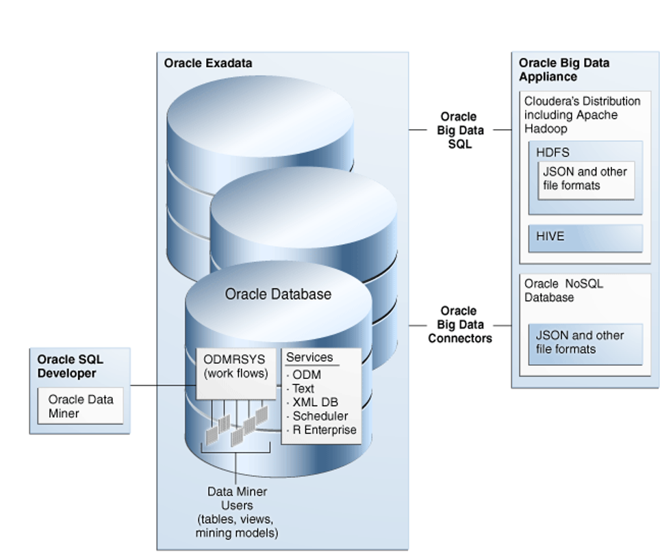

# Introduction

## About Oracle Machine Learning
**Move the algorithms, not the data!**

With Oracle Machine Learning, Oracle moves the algorithms to the data. Oracle runs machine learning within the database, where the data reside. This approach minimizes or eliminates data movement, achieves scalability, preserves data security, and accelerates time-to-model deployment. Oracle delivers parallelized in-database implementations of machine learning algorithms and integration with the leading open source environments R and Python. Oracle Machine Learning delivers the performance, scalability, and automation required by enterprise-scale data science projects.

**Oracle Database - the multi-model converged database**

Users should not have to create and manage multiple databases to access different analytical functionality, which adds complexity and cost. Instead, all such functionality should exist in a single converged, multi-model database, bringing together a broad set of algorithms that can operate on data with various data types and data models. This is a key differentiator for Oracle Database, and reinforces Oracle’s goal to provide such advanced development tools to the widest range of developers.

*Estimated Workshop Time:*  3.5 hours
    

**Features of Oracle Machine Learning**

`Here are a few highlights of Oracle Machine Learning functionality:`

- Oracle integrates machine learning across the Oracle stack and the enterprise, fully leveraging Oracle Database and Oracle Autonomous Database
- Empowers data scientists, data analysts, developers, and DBAs/IT with machine learning
- Eliminates costly data movement and access latency
- Fast and scalable data exploration, data preparation, and machine learning algorithms
- Over 30 algorithms supporting: regression, classification, time series, clustering, feature extraction, anomaly detection
- R and Python integration directly supports data scientist role, leveraging open source ecosystems
- Ease of machine learning model and R/Python script deployment
- Automates key machine learning process steps
- Leverages existing enterprise backup, recovery, and security mechanisms and protocols
- Bring the algorithms to the data
- By including Oracle Machine Learning with Oracle Database on-premises and in the Cloud, Oracle continues to support a next-generation converged data management and machine-learning platform.

### Objectives
* In this workshop, you will gain first-hand experience of using data types beyond relational data - JSON and XML.
* Identify Data Miner interface components.
* Create a Data Miner project.
* Build a Workflow document that uses different type of models to predict customer behavior.

### Prerequisites
- Oracle SQL Developer client
- An Oracle Cloud account, Free Trial, LiveLabs or a Paid account.

Once you complete your setup, the next four labs in this workshop cover these individual data types, and the final lab consists of multi-model examples:

  - Lab : OML Data Miner
  - Lab : OML Data Preparation
  - Lab : OML Regression
  - Lab : OML Market Basket Analysis
  - Lab : OML Clustering

You will also download Oracle SQL Developer to help execute the programs associated with the lab.
    

**This concludes this lab. You may now [proceed to the next lab](#next).**

## Learn More
- [What is a converged database?](https://blogs.oracle.com/database/what-is-a-converged-database)
- [Many single purpose database vs a converged database](https://blogs.oracle.com/database/many-single-purpose-databases-versus-a-converged-database)

## Acknowledgements
- **Owners** - Balasubramanian Ramamoorthy, Amith Ghosh
- **Contributors** - Laxmi Amarappanavar, Venkata Bandaru, Ashish Kumar, Priya Dhuriya, Maniselvan K
- **Team** - North America Database Specialists
- **Last Updated By** - Ashish Kumar, LiveLabs Platform, NA Technology, April 2021
