# OML Regression

## Introduction
In this Lab, you examined and solved a "Regression" prediction data mining business problem by using the Oracle Data Miner graphical user interface, which is included as an extension to SQL Developer.

*Estimated Lab Time*: 30 Minutes

<!-- ### About Oracle Machine Learning "Regression" -->

<!--  -->

### Objectives
In this lab, you will:
* Identify Data Miner interface components.
* Create a Data Miner project.
* Build a Workflow document that uses Regression models to predict customer behavior.

### Prerequisites
This lab assumes you have:
- A Free Tier, Paid or LiveLabs Oracle Cloud account
- SSH Private Key to access the host via SSH
- You have completed:
    - Lab: Generate SSH Keys (*Free-tier* and *Paid Tenants* only)
    - Lab: Prepare Setup (*Free-tier* and *Paid Tenants* only)
    - Lab: Environment Setup
    - Lab: Initialize Environment

## **STEP 1:** Create a Data Miner Project

To create a Data Miner Project, perform the following steps.

1. In the Data Miner tab, right-click the data mining user connection that you previously created, and select **New Project**, as shown here.

    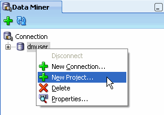

2. In the Create Project window, enter a project name (in this example Regression) and then click **OK**.

    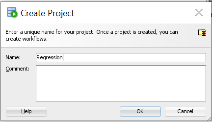

  **Note**: You may optionally enter a comment that describes the intentions for this project. This description can be modified at any time.

3. **Result**: The new project appears below the data mining user connection node.

    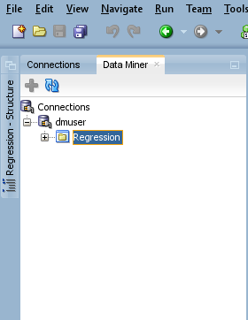

## **STEP 2:** Build a Data Miner Workflow

To create the workflow for this process, perform the following steps.

1. Create a Workflow and Add data for the workflow. Right-click your project (Regression) and select **New Workflow** from the menu.
    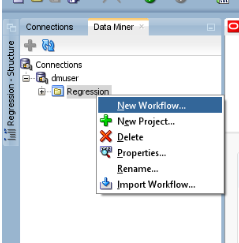

  **Result**: The Create Workflow window appears.

2. In the Create Workflow window, enter **Predicting\_Customer\_Value** as the name and click **OK**.

    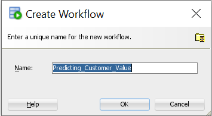

  **Result:**
  In the middle of the SQL Developer window, an empty workflow canvas opens with the name that you specified.On the right-hand side of the interface, the Component Palette tab of the Workflow Editor appears (shown below with a red border).

  In addition, three other Oracle Data Miner interface elements are opened.
    - The Thumbnail tab
    - The Workflow Jobs tab
    - The Property Inspector tab

    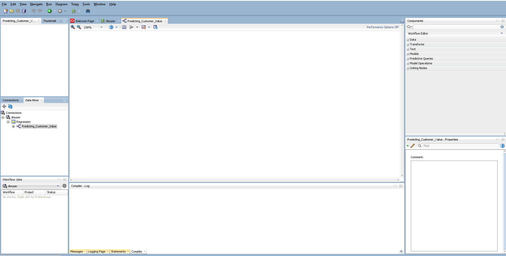

3. The first element of any workflow is the source data. We will extract data from a JSON table and a XM table. Here, we cannot directly add a data source. We will use a query editor to read the tables in a relational table format. You add a Data Source node to the workflow, and select the JSON\_PURCHASEORDER and XML\_PURCHASEORDER tables as the data source.
In the Component Palette, click the **Data** category. A list of data nodes appear, as shown here:
    

4. We will add a  RDBMS regular table data, using a data source. This is the JSON and XML combined table ()
  Drag and drop the **Data Source** node onto the Workflow pane.

  **Result**: A Data Source node appears in the Workflow pane and the Define Data Source wizard opens.
    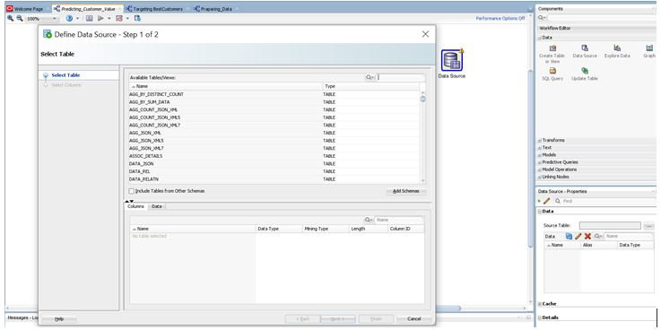

5. In Step 1 of the wizard, select FINAL\_JSON\_XML\_DATA from the Available Tables/Views list, as shown here.

    

  **Note**: You may use the two tabs in the bottom pane in the wizard to view and examine the selected table. The Columns tab displays information about the table structure, and the Data tab shows a subset of data from the selected table or view.

  Click **Next** to continue.

6. In Step 2 of the wizard, you may remove individual columns that you do not need in your data source. In our case, we will keep all of the attributes that are defined in the table.
At the bottom of the wizard window, click **Finish**.

    

  **Result**: As shown below, the data source node name is updated with the selected table name, and the properties associated with the node are displayed in the Property Inspector, located below the Component Palette pane.

    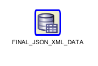

  **Notes:**
  - You can resize nodes in the workflow canvas by entering or selecting a different value from the Zoom options. Notice that 75% has been selected from the Zoom pull-down list.
  - You can add descriptive information about any node by using the Details tab in the Property Inspector.
  - The Thumbnail tab also provides a smaller display of the larger workflow window. As you drag nodes around the workflow window, the thumbnail view automatically adjusts.

## **STEP 3:** Examine the Source Data

You can use an Explore Data node to examine the source data. Although this is an optional step, Oracle Data Miner provides this tool to enable you to verify if the selected data meets the criteria to solve the stated business problem.

Follow these steps:
1. Drag and drop the Explore Data node from the Component Palette to the Workflow, like this:

    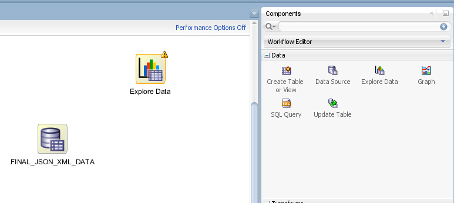

  **Result**: A new Explore Data node appears in the workflow pane, as shown here. (As before, a node name is automatically generated.)

  **Notes:** A yellow Information (!) icon in the border around any node indicates that it is not complete. Therefore, at least one addition step is required before the Explore Data node can be used.
  In this case, a data source node must be "linked" to the Explore Data node to enable further exploration of the source data.

2.	To link the data source and explore data nodes, use the following instructions:

  Right-click the data source node (DATA_RELTN), select Connect from the pop-up menu, and then drag the pointer to the Explore Data node, as shown here:

    

3. Then, click the Explore Data node to connect the two nodes. The resulting display looks like this:

    

4. Double-click the Explore Data node to display the Select Attributes window.In the Group By list, select the CUSTOMER_ID attribute, as shown here:

    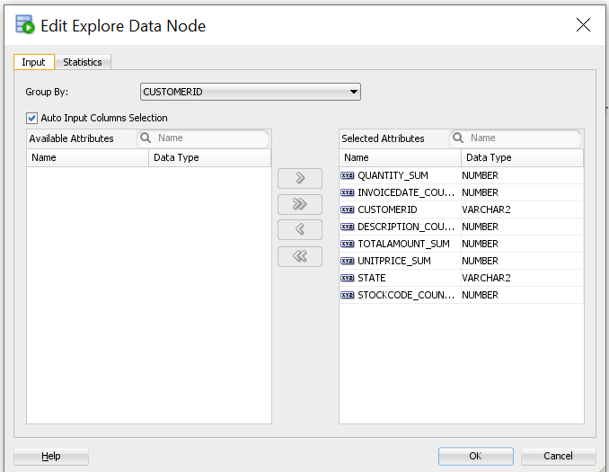

5. Then, click **OK**.

  **Note:** The Select Attributes window also allows you to remove (or re-add) any attributes from the source data.

   Next, right-click the Explore Data node and select **Run**.

    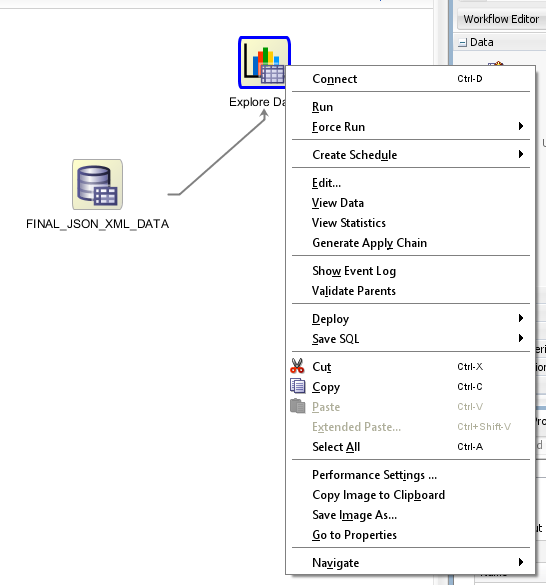

  **Result:**
    - Data Miner displays status information in the Workflow Jobs tab while processing the node.
    - When the update is complete, the data source and explore data nodes show a green check mark in the borders, like this:

    

  **Note:** When you run any process from the workflow canvas, the steps that you have specified are executed by the Oracle Data Miner Server.

6. To see results from the Explore Data node, perform the following.
  Right-click the Explore Data node and select View Data from the menu

    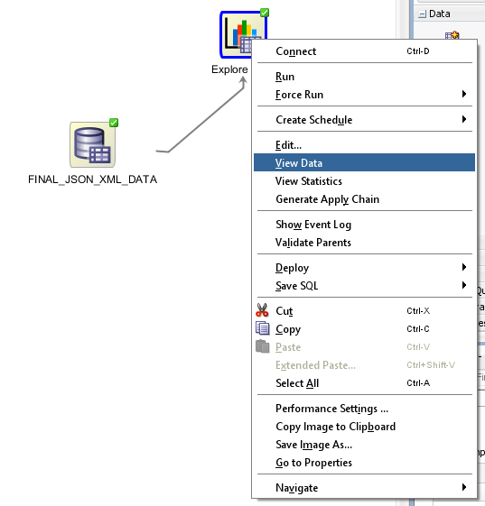

  **Result:** A new tab opens for the data profile node, as shown below

    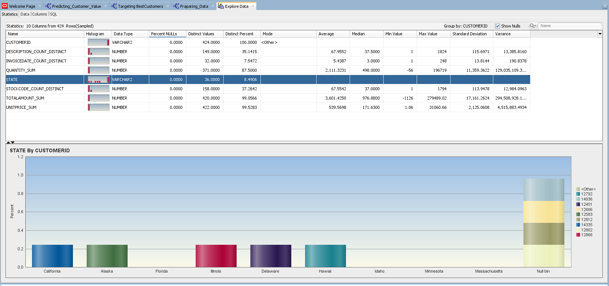

  **Notes:**
  Data Miner calculates a variety of information about each attribute in the data set, as it relates to the "Group By" attribute that you previously defined, including a Histogram, Distinct Values, Mode, Average, Min and Max value, Standard Deviation, Variance, Skewness, and Kurtosis.
  The display enables you to visualize and validate the data, and also to manually inspect the data for patterns or structure.

    - Select any of the attributes in the Name list to display the associated histogram in the bottom window.
    - When you are done examining the source data, dismiss the Explore Data tab by clicking the Close icon (X). 
    - Next, you move from a high-level manual analytic exercise to using the power of database data mining.

7. Save the workflow by clicking the Save All icon in main toolbar.

    

## **STEP 4:** Build the Models

In this topic, you build the selected models against the source data. This operation is also called “training” a model, and the model is said to “learn” from the training data.

   - A common data mining practice is to build (or train) your model against part of the source data, and then to test the model against the remaining portion of your data. By default, Oracle Data Miner this approach.
   - The models have the same build data and the same target.
   - By default, the models are all tested. The test data is created by randomly splitting the build data into a build data set and a test data set. The default ratio for the split is 60 percent build and 40 percent test. When possible Data Miner uses compression when creating the test and build data sets.

1. In the Workflow Editor, expand Models, and click Regression.

2. Drag and drop the node from the Components pane to the Workflow pane.

3. The GUI shows that the node has no data associated with it. Therefore, it cannot be built.

  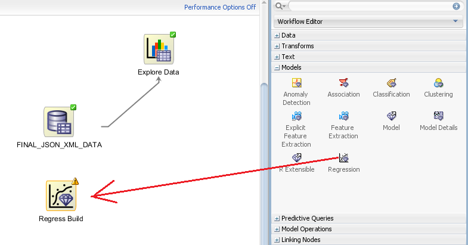

4. Right-click, and click Connect the data to regression node. Drag the line to the Regression node and click again

5. The **Edit Regression Build Node** dialog box opens.
   The Build tab enables you to specify or change the characteristics of the models to build. To edit the characteristics of the model to build, follow these steps.

     - In the Target field, select a target from the drop-down list. The list consist of attributes from the table or view specified in the Data Source node that is connected to the build node. For our use case, we select the TOTALAMOUNT_SUM column
     - You must specify a target. All models in the node have the same target.
     - In the Case ID field, select one attribute from the drop-down list. 
     - This attribute must uniquely identify a case. We will select the column CUSTOMERID.
    
    In the Models Settings list, select which models you want to build. You can build Support Vector Machine (SVM) and Generalized Linear Models (GLM). You can delete any of these models by selecting the model and clicking.

6. To delete any model, select the model and click x. We will keep both the models. 

    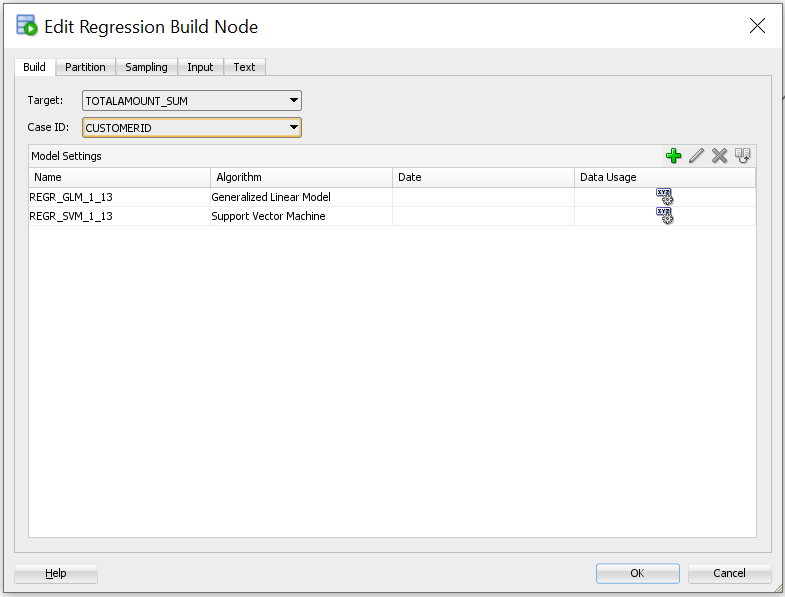

7. Right Click on the **Regression** node and select **Run**

    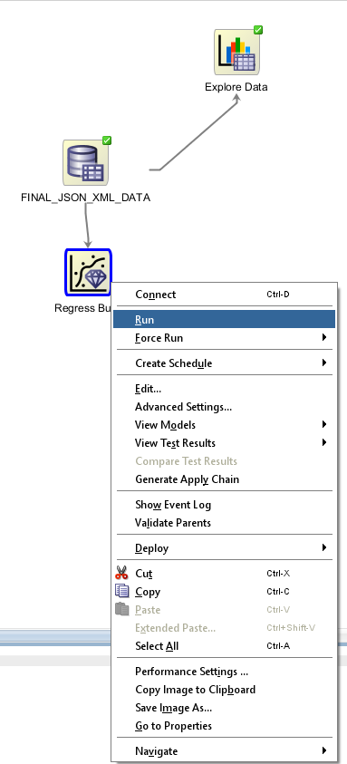

## **STEP 5:** Compare the Models

After you build/train the selected models, you can view and evaluate the results for all of the models in a comparative format. Here, you compare the relative results of all four classification models. Follow these steps:

1. Right-click the classification build node and select **Compare Test Results** from the menu.

    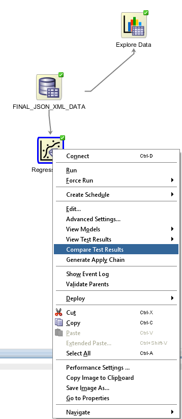

    **Results:** A Class Build display tab opens, showing a graphical comparison of the four models, as shown here:

     - The **Performance** tab displays the test results for several common test metrics. The **Performance** tab for **Regression** model show these measures for all models:

     - By default, All Measures are displayed. The selected measures are displayed as graphs. Since you are comparing test results for two models, then the different models have graphs in different colors.

     - **Predictive Confidence:** Predictive Confidence provides an estimate of accurate the model is. Predictive Confidence is a number between 0 and 1. Oracle Data Miner displays Predictive Confidence as a percentage. For example, the Predictive Confidence of 59 means that the Predictive Confidence is 59 percent (0.59).  Measures how much better the predictions of the mode are than those of the naive model. 

     - **Mean Absolute Error:** The Mean Absolute Error (MAE) is the average of the absolute value of the residuals (error).
     - **Root Mean Square Error:** The Root Mean Squared Error (RMSE) is the square root of the average squared distance of a data point from the fitted line.
     - **Mean Predicted Value:** The average of the predicted values.
     - **Mean Actual Value:** The average of the actual values.

    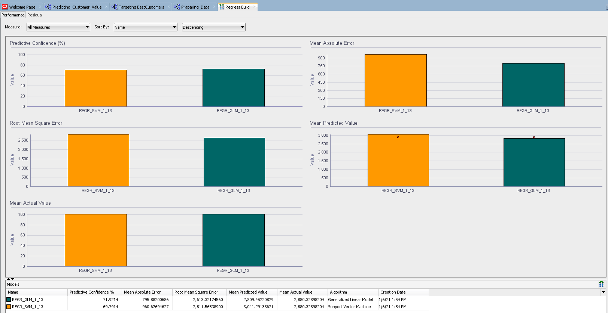

2. The **Residual Plot tab** shows the Residual Plot for each model. You can compare two plots side by side. The **residual plot** is a scatter plot of the residuals. Each residual is the difference between the actual value and the value predicted by the model. Residuals can be positive or negative. If residuals are small (close to 0), then the predictions are accurate. A residual plot may indicate that predictions are better for some classes of values than others.

3. The bottom pane show the Residual result summary table. The table contains the Models grid which supplements the information presented in the plots. You can minimize the table using the splitter line.

4. The table has the following columns:

     - Model, the name of the model along with color of the model in the graphs
     - Predictive Confidence
     - Mean Absolute Error
     - Root Mean Square Error
     - Mean Predicted Value
     - Mean Actual Value
     - Algorithm
     - Creation Date (and time)

5. By default, results for all models in the node are displayed

    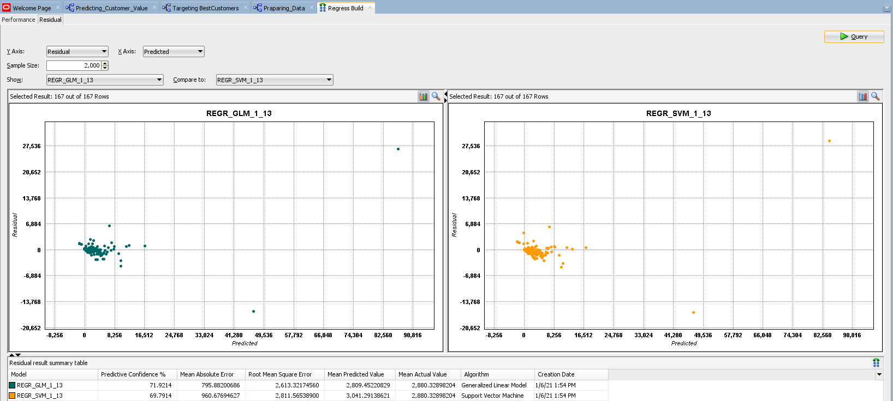

## **STEP 6:** Select and Examine a Specific Model

1. Using the analysis performed in the past topic.

  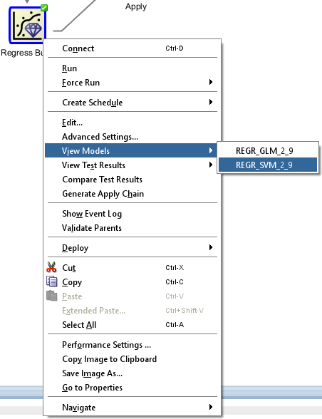
2. The **Coefficients** Tab shows the Regression Coefficients. When you build a multivariate linear regression model, the algorithm computes a coefficient for each of the predictors used by the model. The coefficient is a measure of the impact of the predictor x on the target y.

  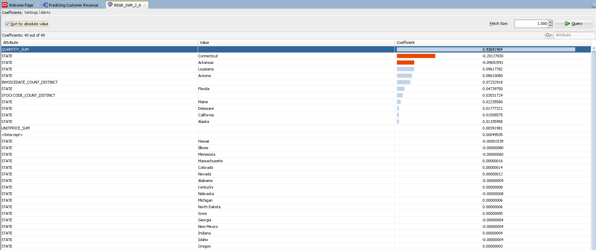

## **STEP 7:** Apply the Model

In this topic, you apply the Regression model and then create a table to display the results. You "apply" a model in order to make predictions - in this case to predict which customers are likely to buy insurance.

1. To apply a model, you perform the following steps.

     - First, specify the desired model (or models) in the Class Build node.
     - Then, you add a new Data Source node to the workflow. (This node will serve as the "Apply" data.)
     - Next, add an Apply node to the workflow.
     - Finally, you link both the Class Build node and the new Data Source node to the Apply node.
     - Follow these steps to apply the model and display the results.

2. In the Workflow Editor, expand **Model Operations**, and click **Apply**. Drag and drop the **Apply** node in the Workflow pane.

    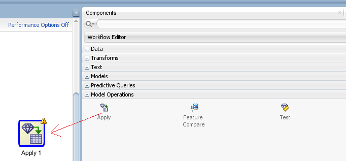

3. Link the Data node, Model nodes, and Build nodes to the Apply Node.  Since we do not have a separate dataset for test data, we will connect the same dataset to the apply node. Alternatively, you can use the sample node to create a separate train data and the remaining data can be used as test data.

4. The Apply node takes a collection of models and returns a single score. The Apply node produces a query as the result. The result can further transformed or connected to a Create Table or View node to save the data as a table.

5. To make predictions using a model, you must apply the model to new data. This process is also called scoring the new data.

6. Right Click and select **Edit** in the context menu.  In the **Edit Apply Node** wizard, uncheck automatic settings.  Select CUSTOMERID as the Case ID.  Now delete the columns Prediction Upper Bounds (PBUP) and Prediction Lower Bounds (PBLW) using the x symbol as shown in the image below.  Click **Ok**. 

    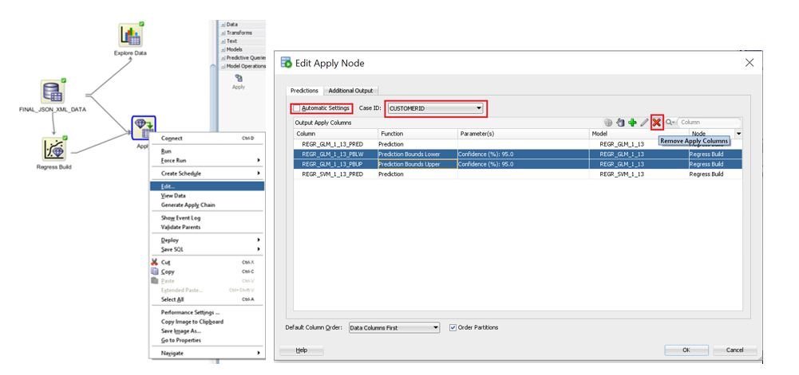

6. Right Click on Apply node and select Run to execute the node. 

    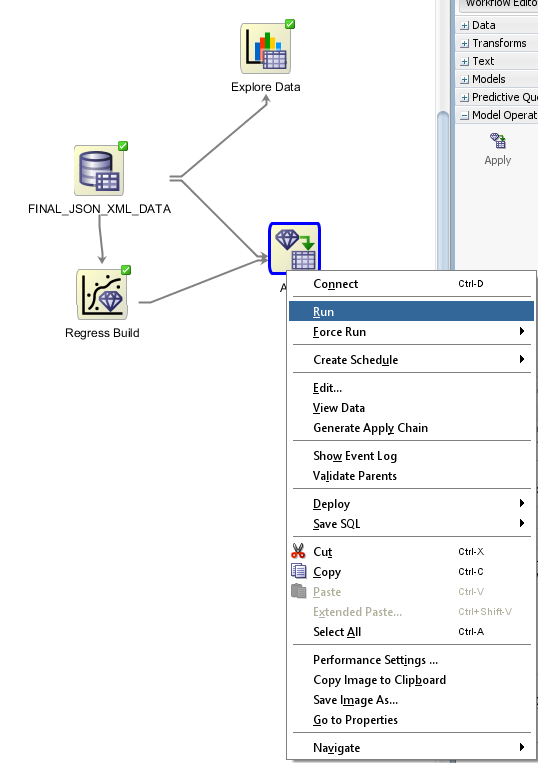

7. After Successful execution, right click on Apply node and select View Data. 

    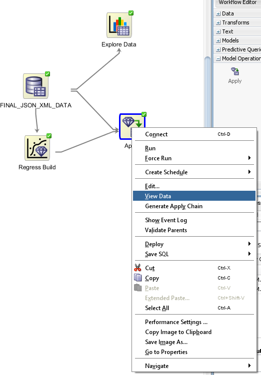

8. An automatic setting that returns the best prediction for the model. The data type returned depends on the target value type used during the build of the model.

    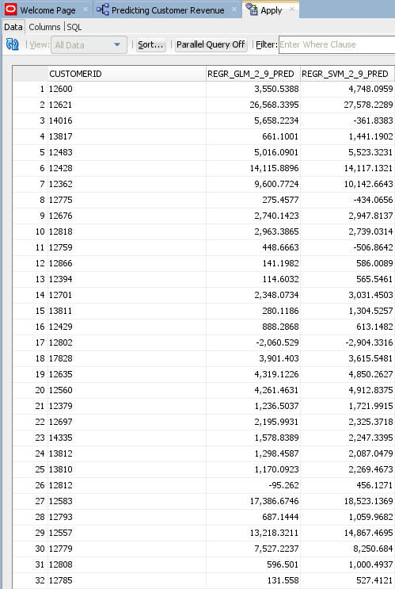

**This concludes this lab. You may now [proceed to the next lab](#next).**

## Rate this Workshop
When you are finished don't forget to rate this workshop!  We rely on this feedback to help us improve and refine our LiveLabs catalog.  Follow the steps to submit your rating.

1.  Go back to your **workshop homepage** in LiveLabs by searching for your workshop and clicking the Launch button.
2.  Click on the **Brown Button** to re-access the workshop  

   

3.  Click **Rate this workshop**

   

<!-- If you selected the **Green Button** for this workshop and still have an active reservation, you can also rate by going to My Reservations -> Launch Workshop. -->

## Acknowledgements
* **Authors** - Balasubramanian Ramamoorthy, Amith Ghosh
* **Contributors** - Laxmi Amarappanavar, Ashish Kumar, Priya Dhuriya, Maniselvan K, Pragati Mourya
* **Last Updated By/Date** - Ashish Kumar, LiveLabs Platform, NA Technology, April 2021
