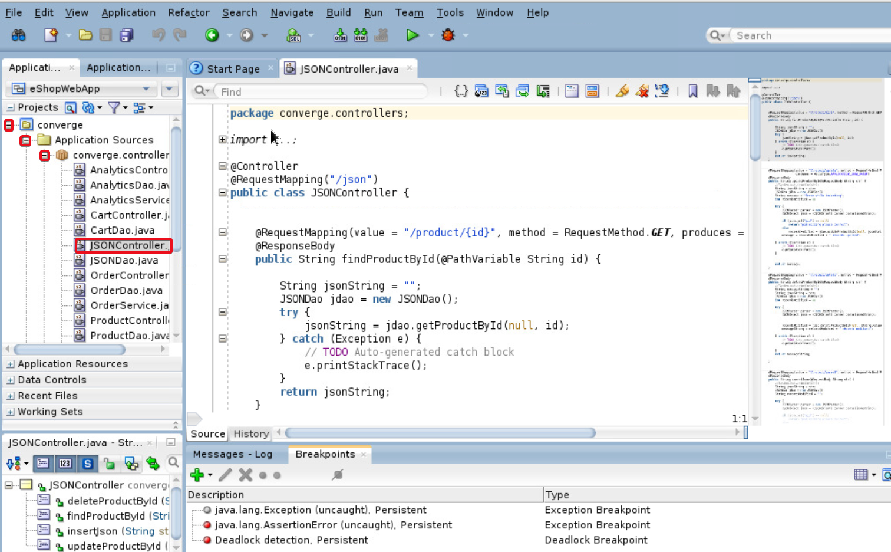

# Data Type Demonstartion Tool 

## Introduction

 In this lab we will launch an application(Datatype Demonstration tool) which will be used to do CRUD operations on different datatypes like JSON, XML and SPATIAL stored in the converged database. 

*Estimated Lab Time*: 10 Minutes

### Objectives
- Get introduced to pre-built data type demonstration tool
- Launch the tool UI 

### Prerequisites
This lab assumes you have:
- A Free Tier, Paid or LiveLabs Oracle Cloud account
- SSH Private Key to access the host via SSH
- You have completed:
    - Lab: Generate SSH Keys
    - Lab: Setup Compute Instance
    - Lab: Start Services
    - Lab: eSHOP Application

### About Datatype Demonstration tool
 The datatype access and testing utility **endPointChecker** is pre-installed as part of the eSHOP application for workshop convenience.
 This tool will be used to perform Create, Retrieve, Update and Delete operations on the different data types.
 The tool makes AJAX calls to the business logic.

## **STEP 1**:  Access data type code 

  The logic for creating REST end points to access data from converged database is written under controllers   as xxxController.java.  All the java class files collecting such data are named as xxxDao.java files.

1. In the JDeveloper under Projects Navigation Pane, under Click on **+** sign against **converge**, Expand **Application Sources**, expand **converge.controllers**.
2. Double click on **JSONController.java** to open it in JDeveloper.
3. Check all the @RequestMapping annotations.  You will find the request method and data type consumed for each method. 

  

4. Note that the code has functions to hold logic for presenting, updating, inserting and deleting JSON datatype.
5. Double click on JSONDao.java to open it in JDeveloper.

  
6. Observe the SQL queries written to do database operations.
7. In the declaration section at top of the file (around line 16) check the GET\_PRODUCT\_BY_ID string and the sql select statement.
8. Also check the getProductById(Connection con,  String id) function consuming the SQL select query and the result set is retrieved as a CLOB.
9. Also check the statement

    ````
    conn = dbs.getJsonXmlConnection();
    
    ````
  Clearly we can understand that this method in **DBSource.java** under converge.dbHelpers is using the be **datasource_jsonXml** bean name declared in **applicationContext.xml**  under **Resources** to get database connection. The bean configuration in-turn points to **converge.oracle.jsonxml** datasource to fetch the records from apppdb (PDB).

10. Similarly, there are controller and DAO files for different datatypes like XML, SPATIAL and Analytics.  Open the code and verify the flow if interested.

## **STEP 2**: Access the tool code

1. Open JDeveloper in **Studio** mode.

    

2. Under **Projects**  expand **Converge**.
3. Navigate to **Web Content** and expand it.
4. Expand **resources**, Open folder **html** to see the UI tool.
5. Double click on **endPointChecker.html** (Optional).

 ***Note***: Accept certificates if prompted and proceed.

    

6. Click on **Source** to view code (Optional).


## **STEP 3**: Launch the demonstrator tool

1. Open the Firefox browser and navigate to `http://localhost:7101/resources/html/endPointChecker.html` OR You can use the bookmark **DataType-End Point Check Utility** under **ConvergedDB-Workshop** in Bookmark Toolbar.
2. Click on the drop-down to see the list of datatypes shown in workshop.
3. Select a datatype and click on **Change View** button to change.

  

***Note***: Certain Datatype's fetch requests may not give results instantaneosly. In certain cases we have to insert data before accessing it. 

## Summary
In summary, you have accessed the data-type demonstration tool deployed along with eShop application and have got familiar with the tool's UI to work with different data-types in the coming labs.

You may now *proceed to the next lab*.

## Acknowledgements
- **Authors** - Pradeep Chandramouli, Nishant Kaushik, Balasubramanian Ramamoorthy, Dhananjay Kumar, AppDev & Database Team, Oracle, October 2020
- **Contributors** - Robert Bates, Daniel Glasscock, Baba Shaik, Meghana Banka, Rene Fontcha
- **Last Updated By/Date** - Kanika Sharma, NA Technology, October 2020

## Need Help?
Please submit feedback or ask for help using our [LiveLabs Support Forum](https://community.oracle.com/tech/developers/categories/livelabsdiscussions). Please click the **Log In** button and login using your Oracle Account. Click the **Ask A Question** button to the left to start a *New Discussion* or *Ask a Question*.  Please include your workshop name and lab name.  You can also include screenshots and attach files.  Engage directly with the author of the workshop.

If you do not have an Oracle Account, click [here](https://profile.oracle.com/myprofile/account/create-account.jspx) to create one.
      