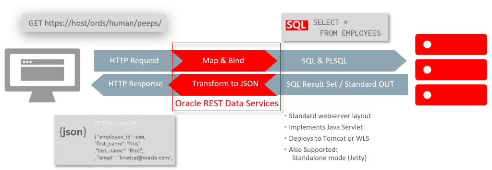
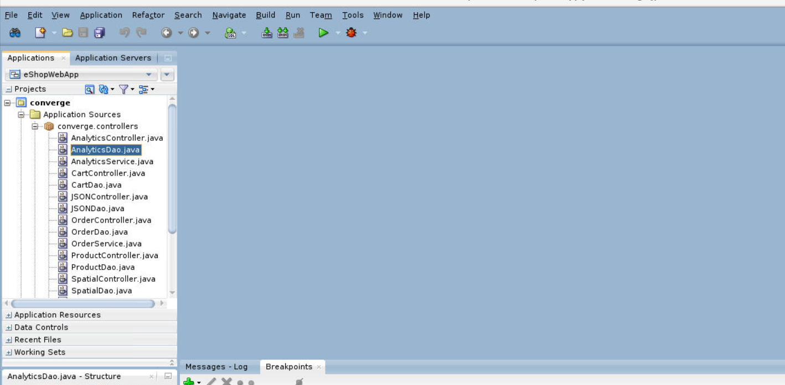
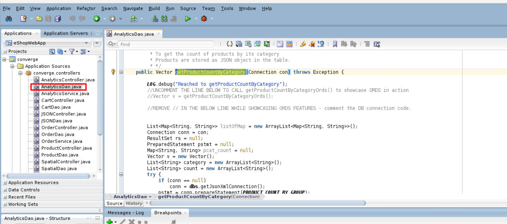
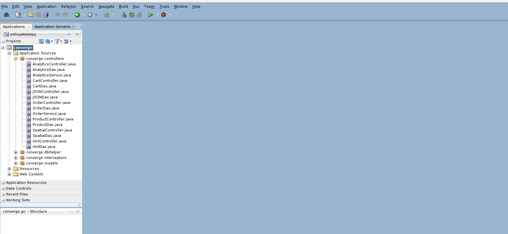
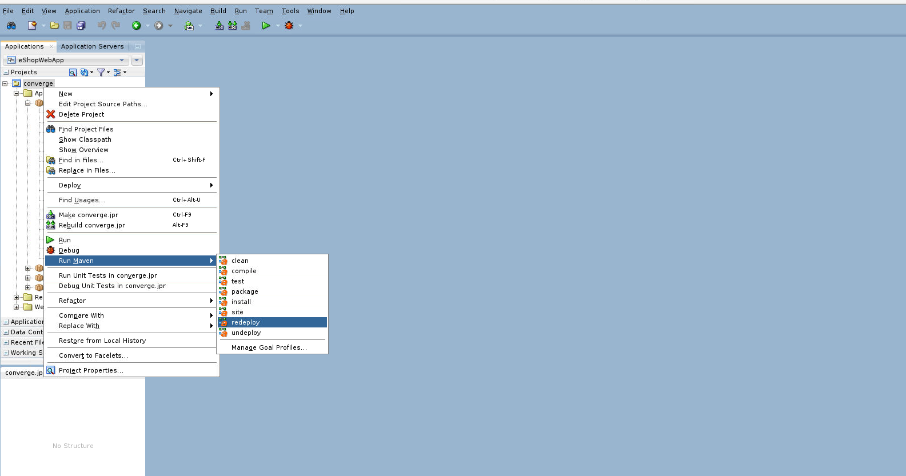

# ORDS as Microservice

## Introduction

This lab demonstrates how micro services are playing a major role in modern application development.
We will learn to use REST end point created using Oracle REST Data Services (ORDS). We will modify the existing eSpeedShop JEE code to replace SQL query and database connection with ORDS URL.

Oracle Converged Database with ORDS – Oracle REST Data Services options enables database to present required data within its tables and views as JSON data over REST on HTTP/HTTPS.

*Estimated Lab Time:* 15 Minutes

### Objectives
- Modify JEE code to replace data from database by ORDS end-point

### Prerequisites
This lab assumes you have:
- A Free Tier, Paid or LiveLabs Oracle Cloud account
- SSH Private Key to access the host via SSH
- You have completed:
    - Lab: Generate SSH Keys
    - Lab: Setup Compute Instance
    - Lab: Start Services
    - Lab: eSHOP Application

### About Oracle REST Data Services (ORDS)

ORDS is middle tier JAVA application that allows you to access your Oracle Database resources via REST. Use standard HTTP calls (GET|POST|PUT|DELETE|HEAD) via URIs that ORDS makes available.

ORDS will find and run the appropriate database workload (a query, an anonymous block), and return the output as formatted JSON.





## **STEP 1**: Observe eSpeedShop analytical data

1. Open web browser, type `http://localhost:7101/` and hit enter to go to eSpeedShop application home page.

2. Navigate to the analytics module by clicking the Analytics link provided in application navigation bar at the top.

    

3. Once redirected, observe the **Category shares in Product count** section, which displays a pie chart to show count of products by different categories.

    

## **STEP 2**: Modify data access code

1. Open JDeveloper in Studio Mode, if not open already.

2. On the left side in the projects panel, locate converge application folder.

    

3. Expand the **converge** application folder and locate **Application Sources** directory.

4. Under **Application Sources** expand **converge.controllers**, which contains the application supporting java files.

5. Open AnalyticsDao.java.

    

6. Search for **getProductCountByCategory** function, which is fetching data from database for **Category shares in Product count** section in Analytics page.

    

7. Look for the function body and make sure it is getting data by executing the SQL query string named **PRODUCT\_COUNT\_BY_GROUP**.

8. Modify the function in such a way that instead of getting data by executing the SQL, it should fetch data from the provided ORDS URL.

    In order to achieve that, uncomment the function call below:
    ````
    <copy>    
    Vector v = getProductCountByCategoryOrds();
    </copy>
    ````
    comment the function body after the above line, except the return statement at the end of function body.

   
9. Once done, save the changes using **Ctrl + s**.


## **STEP 3**: Build and redeploy eSpeedShop application


1.	In JDeveloper, go to the project panel and right click on the project folder (converge).

    

2.	Go to **Run Maven** option in the menu.

3.	Select **redeploy** to execute the maven redeploy goal and redeploy application on weblogic server.

    

4.	Wait and observe JDeveloper console for redeployment confirmation.

    


## **STEP 4**: Re-check analytical data

1.	Go to the browser.

2.	Open the eSpeedShop application by entering the URL – localhost:7101.

3.	Navigate to the analytics module by clicking the Analytics link, provided in the application navigation bar at the top.

    

4.	Check the **Product Count By Category**, the pie chart is still plotting the same data the only difference is that this time it is getting data from the ORDS end point.

    


## Summary
In summary, you replaced the business logic to retrieve JSON data-type from converged database with the URL fetching the same data over REST using Oracle REST Data Services(ORDS).

You have successfully completed *Converged Database for WebLogic Developer* workshop 

## Want to learn more
- [ORDS](https://www.oracle.com/in/database/technologies/appdev/rest.html)
- [Consuming a Database-Bound RESTful Web Service](https://docs.oracle.com/cd/E53569_01/tutorials/tut_rest_ws/tut_rest_ws.html)


## Acknowledgements
- **Authors** - Pradeep Chandramouli, Nishant Kaushik, Balasubramanian Ramamoorthy, Dhananjay Kumar, AppDev & Database Team, Oracle, October 2020
- **Contributors** - Robert Bates, Daniel Glasscock, Baba Shaik, Meghana Banka, Rene Fontcha
- **Last Updated By/Date** - Kanika Sharma, NA Technology, October 2020

## Need Help?
Please submit feedback or ask for help using our [LiveLabs Support Forum](https://community.oracle.com/tech/developers/categories/livelabsdiscussions). Please click the **Log In** button and login using your Oracle Account. Click the **Ask A Question** button to the left to start a *New Discussion* or *Ask a Question*.  Please include your workshop name and lab name.  You can also include screenshots and attach files.  Engage directly with the author of the workshop.

If you do not have an Oracle Account, click [here](https://profile.oracle.com/myprofile/account/create-account.jspx) to create one.


