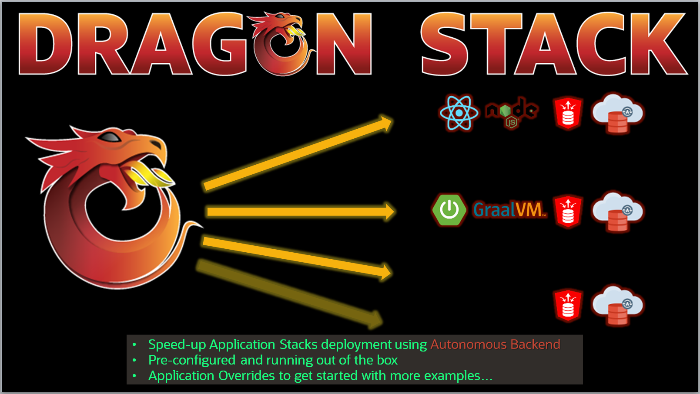

# Introduction

## About this Workshop

This workshop introduces the Oracle DRAGON stack project, a simple way to deploy applications using an Oracle Autonomous Database, using an Always Free Oracle Autonomous Transaction Processing (ATP), Oracle Autonomous JSON Database, or Oracle Autonomous Data Warehouse. In this short workshop, you'll download the DRAGON Stack manager and deploy a React based stack on Oracle Cloud.

Estimated Workshop Time: 10 minutes

### About the DRAGON Stack manager
The DRAGON Stack manager is an open-source project which provides the fastest way to build and run applications connected to an Autonomous Database shared infrastructure. It can indeed:
 - provision and configure an Autonomous Database as well as load JSON data into collections while taking care of the side resources such as Oracle Cloud Infrastructure Object Storage buckets
 - integrates SQL Developer Web and Oracle REST Data Services integration with standard application development frameworks such as React or Spring-Boot
 - generates project source code to start coding as soon as possible!  

  

### Prerequisites

* An Oracle Free Tier, Always Free, Paid or LiveLabs Cloud Account

You may now [proceed to the next lab](#next).

## Learn More

*Any links you want to include?*

* [DRAGON Stack manager portal](https://bit.ly/DRAGONStackManager)
* [DRAGON Stack manager on GitHub](https://bit.ly/DragonStack)

## Acknowledgements
* **Author** - Loic Lefevre, Principal Product Manager
* **Last Updated By/Date** - Tom McGinn, Database Product Management, November 2020

## Need Help?
Please submit feedback or ask for help using our [LiveLabs Support Forum](https://community.oracle.com/tech/developers/categories/livelabsdiscussions). Please click the **Log In** button and login using your Oracle Account. Click the **Ask A Question** button to the left to start a *New Discussion* or *Ask a Question*.  Please include your workshop name and lab name.  You can also include screenshots and attach files.  Engage directly with the author of the workshop.

If you do not have an Oracle Account, click [here](https://profile.oracle.com/myprofile/account/create-account.jspx) to create one.
