# Add Pages for Data Manipulation to an Oracle Visual Builder Mobile Application

## Introduction

This tutorial shows you how to use the Quick Starts provided with Oracle Visual Builder to generate pages, buttons, and swipe actions that enable you to view, edit, and delete data in a mobile application.

### Estimated Lab Time:  10 minutes

### Background

Oracle Visual Builder provides Quick Starts that create pages to help you quickly build your mobile application. Quick Starts facilitate the creation of pages to display, create, edit, and delete data. You can invoke the Quick Start you want to use when you select the appropriate component in the page. Typically, this is a List View component when you develop a mobile application.

## **STEP 1**: Add a Detail Page for the Department Business Object

1.  In the HR Application, click the **Mobile Applications**  tab in the Navigator.
2.  If necessary, expand the **flows** and **main** nodes, then click **main-departments**.
3.  In the Page Designer, click the **Structure** tab and select **List View**.
4.  In the Properties pane, click the **Quick Start** tab, then click **Add Detail Page**.
5.  On the Select Endpoint page, select **Department** under Business Objects if necessary and click **Next**.

    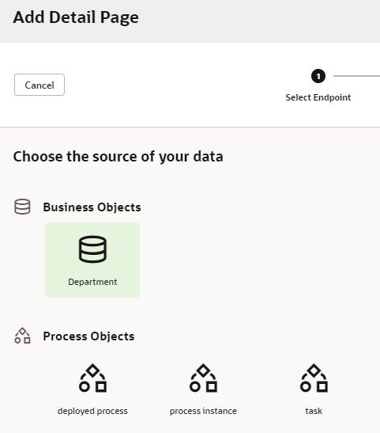

6.  On the Page Details page, under Endpoint Structure, select **name** and **location**, in that order, and click **Finish**.

    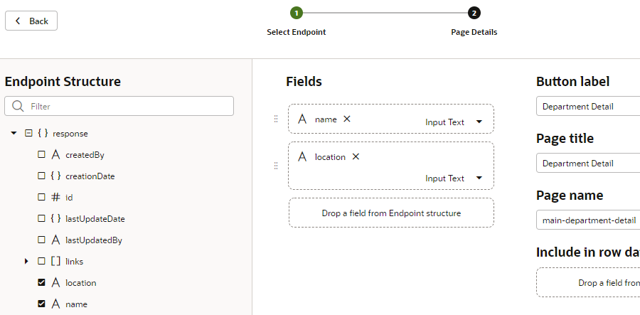

    The main-department-detail page is created, and a selection event is configured for the List View component on the main-departments page. This selection event navigates users who tap a list item on the main-departments page to the main-department-detail page where they can view more detail about the selected department.

7.  To view the Department Detail page, click **Live** for the main-departments page, then select a department. Click the **Structure** tab to make room for your view.

    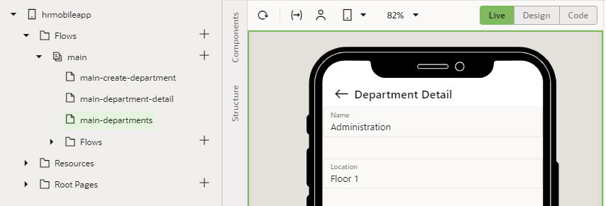

## **STEP 2**: Add an Edit Page for the Department Business Object

1.  Return to the main-departments page and click **Design**. If necessary, select the **List View** component in the **Structure** view.
2.  In the Quick Start menu, click **Add Edit Page**.
3.  On the Select Read Endpoint and Select Update Endpoint pages of the Quick Start, select **Department** under Business Objects.
4.  On the Page Details page, select **location** under Endpoint Structure (**name** is already selected), and click **Finish**.
5.  Click the **main-department-detail** page.
6.  Click the **Components** tab, then drag a **Button** component to the right of the Department Detail page title, until you see the pop-up with the available slots. Drop the button in the **Right Side** slot. The Button component appears to the right of Department Detail in the Page Designer.

    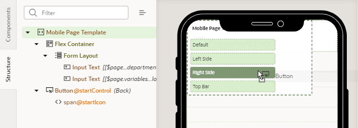

7.  On the **General** tab of the Button's Properties pane, enter `Edit` in the **Text** field.
8.  Click the **Events** tab for the button, click **\+ New Event,** and then select **Quick Start: 'ojAction'** from the menu.

    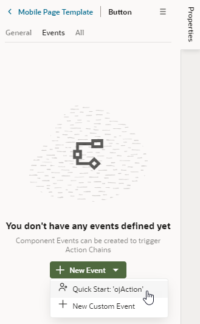

    An action chain with the `ButtonActionChain` ID is created. It contains only the **Start** action.

9.  Drag the **Navigate** action from the **Navigation** section of the **Actions** palette to the **+** sign that the Start action points to. From the **Target** drop-down list, select **main-edit-department**.

    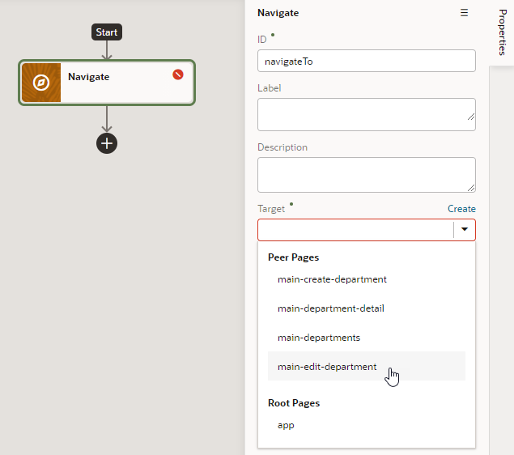

    The action now has the label `Navigate main-edit-department`.

10.  To map the source variables in the main-department-detail page to the target parameters in the main-edit-department page, click **NOT MAPPED** under **Input Parameters**.

    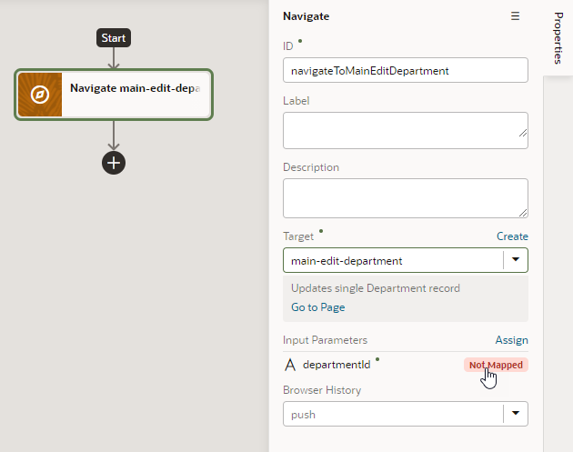

11.  In the Assign Input Parameters dialog box, drag a line from the **departmentId** variable in the **Sources** list to the **departmentId** parameter in the **Target** list, and click **Save**.

    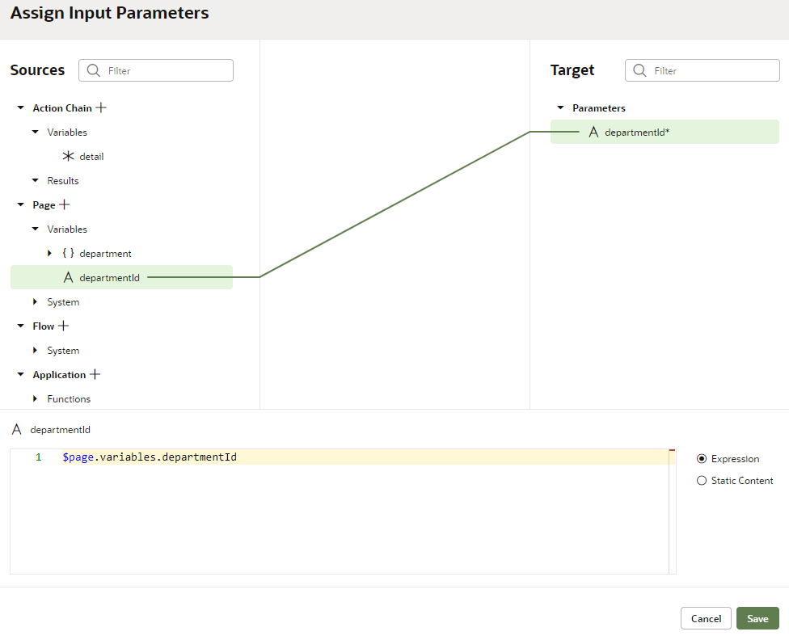

## **STEP 3**: Add a Delete Action for the Department Business Object

1.  Go to the main-departments page, and if necessary click the **List View** component in the **Structure** view.
2.  In the Quick Start menu, click **Add Delete Action**.
3.  On the Select Endpoint page of the Quick Start, select **Department** under Business Objects and click **Finish**.
4.  In the Properties pane, click the **General** tab. Under **Swipe Actions**, drag the handle for the **Delete** action from **Right Side end** to **Left Side start**.

    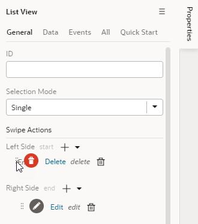

## **STEP 4**: Test Your New Departments Pages

1.  Click **Preview** .

    The application opens in another browser tab or window. 

2.  On the Departments page, click **Administration** to open the Department Detail page. Make sure you click near the Id field to open the detail page.

    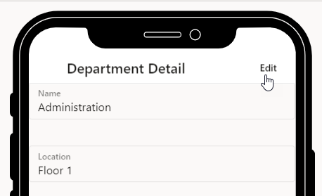

3.  Click **Edit** to change the record.
4.  On the Edit Department page, enter `Top Floor` in the **Location** field, and then click **Save**.

    A confirmation message is displayed, and the application navigates back to the Department Detail page. The change that you just made appears in the Department Detail page.

5.  To return to the Departments page, click the Back icon .
6.  If you have a touch screen environment, swipe from the left edge of the screen to the right . A **Delete** button appears.

    When you click **Delete** in a desktop browser environment that does not have a touch screen, the action is ignored. When you tap **Delete** on a device with a touch screen, the swiped list item is deleted.

    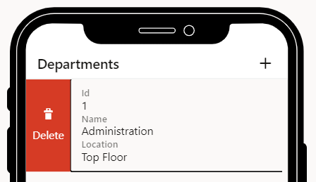

7.  Swipe from the right edge of the screen to the left. An **Edit** button appears. As with the **Delete** button, the swipe action requires a touch screen environment to function. 
8.  Close the tab or window.

## Acknowledgements
**Author** - Sheryl Manoharan

**Last Updated** - February 2021
