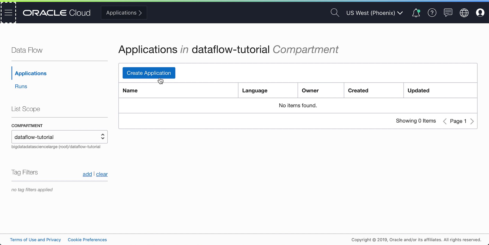
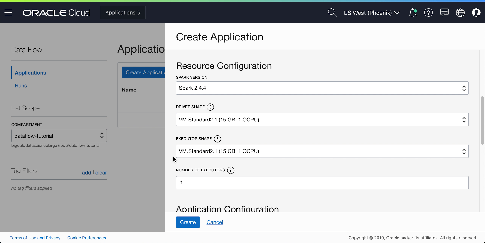
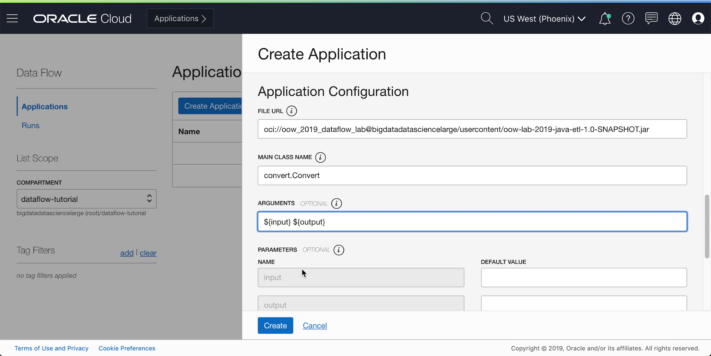
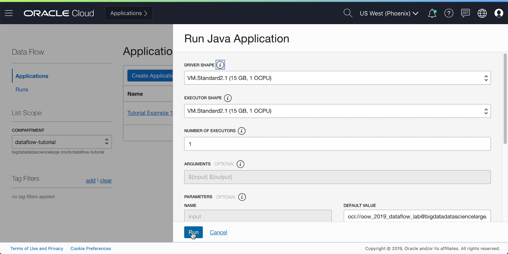
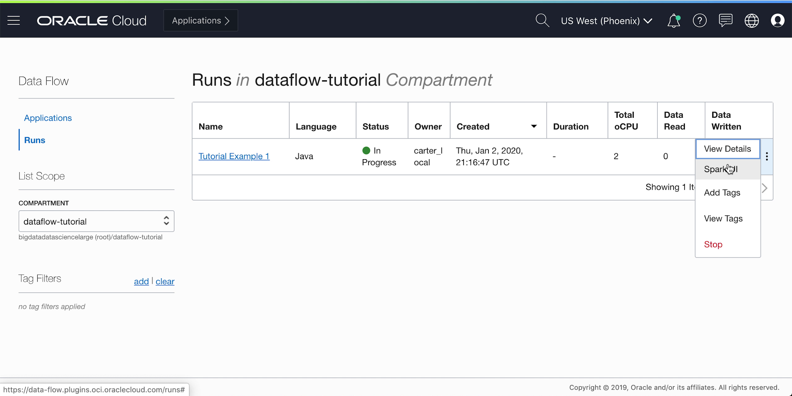
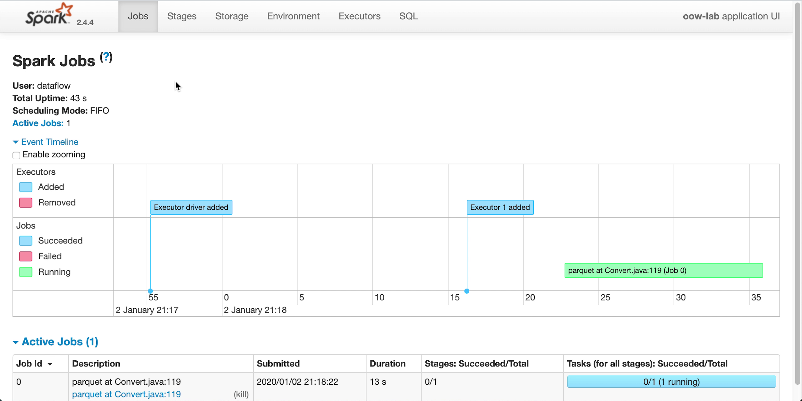
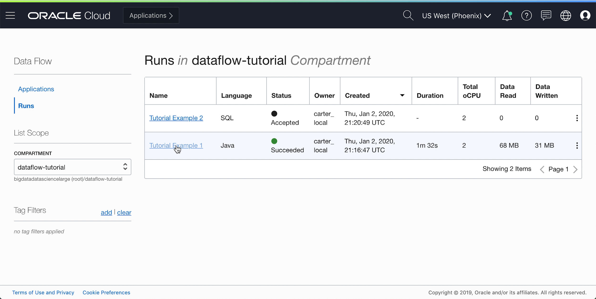
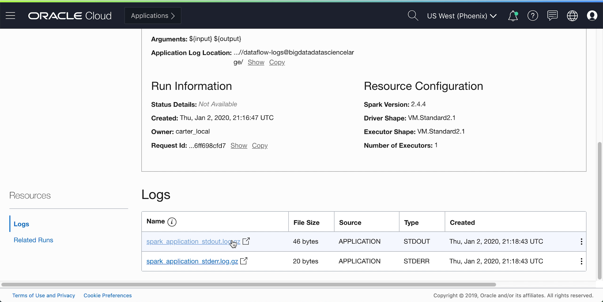
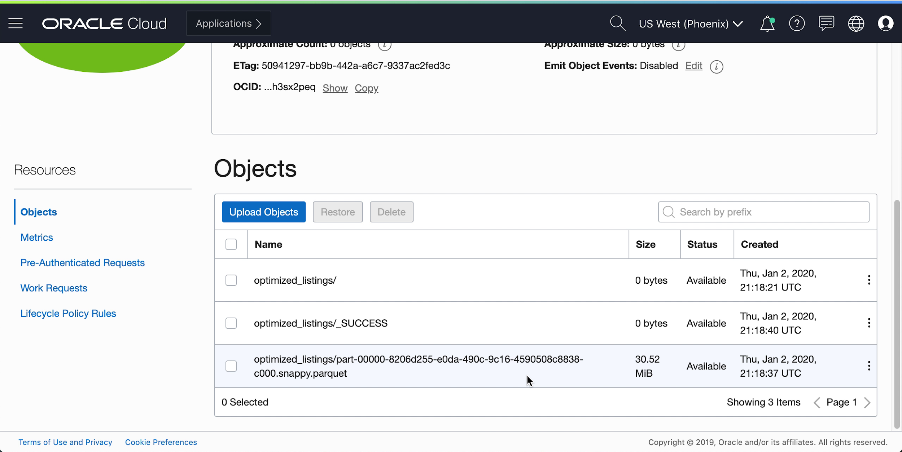

# Getting Started

## ETL with Java

This tutorial introduces you to Oracle Cloud Infrastructure Data Flow, a service that lets you run any Apache Spark Application  at any scale with no infrastructure to deploy or manage. If you've used Spark before, you'll get more out of this tutorial, but no prior Spark knowledge is required. All Spark applications and data have been provided for you. This tutorial shows how Data Flow makes running Spark applications easy, repeatable, secure, and simple to share across the enterprise.

*Estimated Lab Time*: 25 minutes

### Objectives

In Spark, your first step is usually to clean and convert data from a text format into Parquet format. Parquet is an optimized binary format supporting efficient reads, making it ideal for reporting and analytics. In this lab, you take source data, convert it into Parquet, and then do a few interesting things with it. Your dataset is the [Berlin Airbnb Data dataset](https://www.kaggle.com/brittabettendorf/berlin-airbnb-data), downloaded from the Kaggle website under the terms of the Creative Commons CC0 1.0 Universal (CC0 1.0) "Public Domain Dedication" license.

The data is provided in CSV format and your first step is to convert this data to Parquet and store it in object store for downstream processing. There is a Spark application provided to make this conversion. It is called `oow-lab-2019-java-etl-1.0-SNAPSHOT.jar`. Your objective is to create a Data Flow Application which runs this Spark app, and execute it with the correct parameters. This lab guides you step by step, and provides the parameters you need.

  

### Prerequisites

* Lab 0 to setup Data Flow.

* From the Console, click the hamburger menu to display the list of available services. Select Data Flow and click `Applications`

* Basic understanding of Java


## **STEP 1**: Create Java Application

1. Navigate to the Data Flow service in the Console by expanding the hamburger menu on the top left and scrolling to the bottom

*Note: If you get an error about missing logs or warehouse bucket, see these setup instructions in Lab 0*   


2. Highlight Data Flow, then select **Applications**. Choose a compartment where you want your Data Flow applications to be created. Finally, click **Create Application**.  

    

3. Select **Java Application** and enter a name for your Application, for example, _Tutorial Example 1_

4. Scroll down to `Resource Configuration`. Leave all these values as their defaults.    



5. Scroll down to Application Configuration. Configure the application as follows:

     1. Provide the **File URL**. It is the location of the JAR file in object storage. The location for this application is:

      ```
      <copy> oci://oow_2019_dataflow_lab@bigdatadatasciencelarge/usercontent oow-lab-2019-java-etl-1.0-SNAPSHOT.jar</copy>
      ```

     2. Java applications need a **Main Class Name** which depends on the application. Hit **Enter**

      ```
      <copy>convert.Convert</copy>
      ```

     3. The Spark application expects two command line parameters, one for the input and one for the output. In the **Arguments** field, enterprise

      ```
       <copy>${input} ${output}</copy>
      ```
      

6. Enter the following as input and output:

    1. `Input`

      ```
      <copy>
      oci://oow_2019_dataflow_lab@bigdatadatasciencelarge/usercontent/kaggle_berlin_airbnb_listings_summary.csv
      </copy>
      ```

    2. `Output`

    ```
    <copy>
    oci://<yourbucket>@<namespace>/optimized_listings
    </copy>
    ```

    At this stage your application Configuration should look like this :
    

  *Note: The output path should point to your bucket in the tenancy*

7. When done, click **Create**. When the Application is created, you see it in the Application list.

   

## **STEP 2**: Run the Data Flow Java Application

1. Highlight your Application in the list, click the **Actions** icon, and click **Run**

   

2. You’re presented with the ability to customize parameters before running the Application. In your case, you entered the precise values ahead-of-time, and you can start running by clicking `Run`   

   

3. While the Application is running, you can optionally load the **Spark UI**  to monitor progress. From the **Actions** icon for the run in question, select **Spark UI**

   

4. You are automatically redirected to the Apache Spark UI, which is useful for debugging and performance tuning.

   

5. After a minute or so your `Data Flow Run`  should show successful completion with a State of Succeeded:

   

6. Drill into the Run to see more details, and scroll to the bottom to see a listing of logs.

   

7. When you click the `spark_application_stdout.log.gz`  file, you should see the following log output

   

8. You can also navigate to your output object storage bucket to confirm that new files have been created.

   

*Note: These new files are used by subsequent labs. Ensure you can see them in your bucket before moving onto the next lab*   

## Acknowledgements

- **Author** - Anand Chandak
- **Adapted by** -  
- **Contributors** -
- **Last Updated By/Date** -

